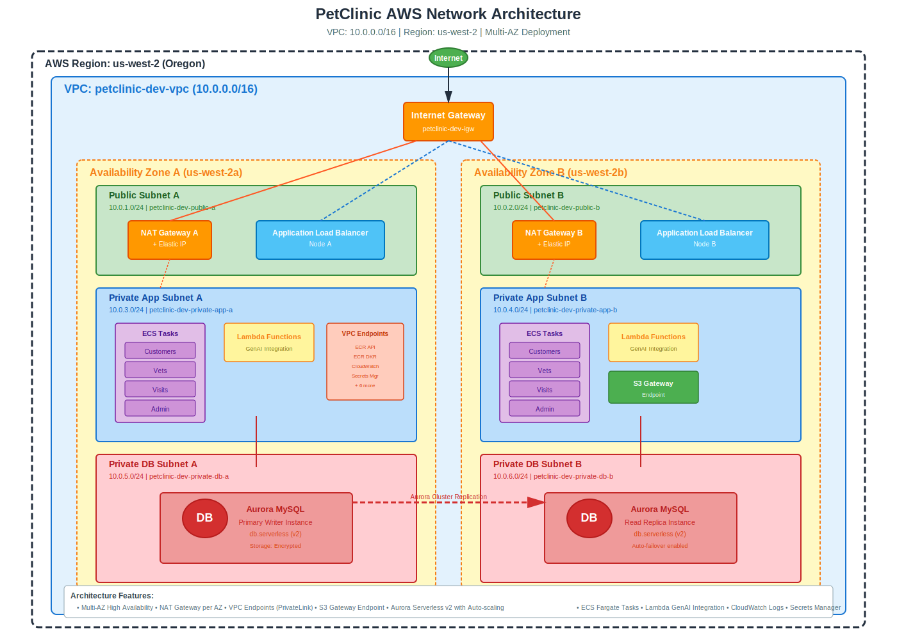

# PetClinic AWS Network Architecture

## 📋 개요

PetClinic 애플리케이션의 네트워크 아키텍처는 **AWS Well-Architected Framework**의 네트워킹 원칙을 따라 설계되었습니다. Multi-AZ 구성으로 고가용성을 보장하며, 보안과 확장성을 고려한 3-Tier 네트워크 구조를 사용합니다.

## 🏗️ 아키텍처 다이어그램



## 📊 네트워크 구성 요약

### 기본 정보

| 항목 | 값 |
|------|-----|
| **VPC CIDR** | 10.0.0.0/16 |
| **Region** | us-west-2 (Oregon) |
| **Availability Zones** | us-west-2a, us-west-2b |
| **DNS Support** | Enabled |
| **DNS Hostnames** | Enabled |
| **IPv6** | Disabled (현재) |

### 서브넷 구성

| 서브넷 타입 | AZ-A (2a) | AZ-B (2b) | 용도 |
|------------|-----------|-----------|------|
| **Public** | 10.0.1.0/24 | 10.0.2.0/24 | NAT Gateway, ALB |
| **Private App** | 10.0.3.0/24 | 10.0.4.0/24 | ECS Tasks, Lambda |
| **Private DB** | 10.0.5.0/24 | 10.0.6.0/24 | Aurora MySQL |

**총 서브넷 수**: 6개 (3 types × 2 AZs)

## 🌐 네트워크 계층 구조

### 1. Public Subnet (퍼블릭 서브넷)

**목적**: 인터넷과 직접 통신이 필요한 리소스 배치

#### 배치 리소스:
- **NAT Gateway**: 프라이빗 서브넷의 아웃바운드 인터넷 접속
- **Application Load Balancer**: 외부 트래픽 수신 및 분배
- **Bastion Host** (선택적, 개발 환경): SSH 접속용

#### 라우팅:
```
Destination         Target
0.0.0.0/0          Internet Gateway (igw)
10.0.0.0/16        Local (VPC)
S3 Prefix Lists    S3 Gateway Endpoint
```

#### 보안:
- ✅ `map_public_ip_on_launch: true` (자동 퍼블릭 IP 할당)
- ✅ Security Group으로 인바운드 제한 (443, 80만 허용)
- ✅ Network ACL로 추가 보호

### 2. Private App Subnet (프라이빗 앱 서브넷)

**목적**: 애플리케이션 워크로드 실행 (외부 직접 접근 불가)

#### 배치 리소스:
- **ECS Fargate Tasks**:
  - Customers Service
  - Vets Service
  - Visits Service
  - Admin Service
- **Lambda Functions**: GenAI 통합 (Bedrock 연동)
- **VPC Endpoints**: AWS 서비스 프라이빗 접근

#### 라우팅 (AZ별로 독립):
```
# Private App Route Table A
Destination         Target
0.0.0.0/0          NAT Gateway A
10.0.0.0/16        Local (VPC)
S3 Prefix Lists    S3 Gateway Endpoint
VPC Endpoint IPs   Local ENI
```

#### 보안:
- ✅ `map_public_ip_on_launch: false` (퍼블릭 IP 없음)
- ✅ NAT Gateway를 통한 아웃바운드만 허용
- ✅ Security Group으로 ALB/DB만 접근 허용
- ✅ VPC Endpoint로 AWS 서비스 프라이빗 접근

### 3. Private DB Subnet (프라이빗 DB 서브넷)

**목적**: 데이터베이스 전용 격리 계층 (인터넷 접근 불가)

#### 배치 리소스:
- **Aurora MySQL Cluster**:
  - Primary Writer Instance (AZ-A)
  - Read Replica Instance (AZ-B)
- **RDS Proxy** (선택적): 연결 풀링

#### 라우팅:
```
# Private DB Route Table (No Internet Access!)
Destination         Target
10.0.0.0/16        Local (VPC)
S3 Prefix Lists    S3 Gateway Endpoint (백업용)
```

**⚠️ 주의**: DB 서브넷은 **0.0.0.0/0 라우트 없음** → 인터넷 완전 차단

#### 보안:
- ✅ 최고 수준 격리 (NAT Gateway 없음)
- ✅ App 서브넷에서만 접근 가능 (Security Group)
- ✅ 저장 데이터 암호화 (Storage Encrypted)
- ✅ 전송 데이터 암호화 (SSL/TLS 강제)

## 🔒 보안 설계

### Internet Gateway (IGW)

- **역할**: VPC와 인터넷 간 양방향 통신
- **대상**: Public 서브넷만
- **보안**: Security Group + WAF로 보호

### NAT Gateway (Multi-AZ)

**설정**: `create_nat_per_az: true` (AZ당 1개)

| AZ | NAT Gateway | Elastic IP | 대상 서브넷 |
|----|-------------|-----------|-------------|
| us-west-2a | petclinic-dev-nat-a | EIP-1 | Private App A |
| us-west-2b | petclinic-dev-nat-b | EIP-2 | Private App B |

**장점**:
- ✅ AZ 장애 격리 (한쪽 NAT 장애 시 다른 AZ 영향 없음)
- ✅ 대역폭 분산 (각 NAT Gateway 최대 45 Gbps)
- ✅ 고가용성 (Multi-AZ 자동 장애 조치)

**단점**:
- ⚠️ 비용 증가 (NAT Gateway 2개 + 데이터 전송 비용)

**비용 최적화 (선택적)**:
```hcl
# terraform/envs/dev.tfvars
create_nat_per_az = false  # 단일 NAT Gateway (비용 절감)
```

### VPC Endpoints

**목적**: AWS 서비스 프라이빗 접근 (인터넷 경유 없이)

#### Interface Endpoints (PrivateLink)

배치: Private App 서브넷 (ENI 생성)

| 서비스 | 용도 | 포트 |
|--------|------|------|
| **ecr.api** | ECR API 호출 | 443 |
| **ecr.dkr** | Docker 이미지 Pull | 443 |
| **logs** | CloudWatch Logs | 443 |
| **xray** | X-Ray 트레이싱 | 443 |
| **ssm** | Systems Manager | 443 |
| **ssmmessages** | Session Manager | 443 |
| **ec2messages** | SSM Agent 통신 | 443 |
| **secretsmanager** | 시크릿 관리 | 443 |
| **kms** | 암호화 키 관리 | 443 |
| **monitoring** | CloudWatch Metrics | 443 |

**Security Group**:
```hcl
Ingress:
  - Port: 443 (HTTPS)
  - Source: VPC CIDR (10.0.0.0/16)

Egress:
  - Port: All
  - Destination: 0.0.0.0/0
```

**비용**: 시간당 $0.01 × 10 endpoints = **$7.2/month** (고정)

#### Gateway Endpoint (S3)

배치: 모든 라우트 테이블에 자동 추가

| 서비스 | 용도 | 비용 |
|--------|------|------|
| **S3** | 백업, 로그 저장 | 무료 |

**장점**:
- ✅ 무료 (데이터 전송 비용만 발생)
- ✅ NAT Gateway 트래픽 감소
- ✅ 높은 대역폭 (제한 없음)

## 🔄 트래픽 흐름

### 1. 인바운드 트래픽 (클라이언트 → 애플리케이션)

```
Internet
  ↓
Internet Gateway (IGW)
  ↓
Application Load Balancer (Public Subnet)
  ↓
Target Group Health Check
  ↓
ECS Fargate Task (Private App Subnet)
  ↓
Aurora MySQL (Private DB Subnet)
```

**경로 세부사항**:
1. 클라이언트 요청 → `*.elb.amazonaws.com` (DNS)
2. IGW → ALB Security Group 확인 (443 허용)
3. ALB → Target Group 라우팅 규칙 적용
4. ECS Task Security Group 확인 (ALB에서만 허용)
5. DB Security Group 확인 (App Subnet에서만 허용)

### 2. 아웃바운드 트래픽 (애플리케이션 → 인터넷)

```
ECS Task (Private App Subnet)
  ↓
Private Route Table
  ↓
NAT Gateway (Public Subnet)
  ↓
Internet Gateway (IGW)
  ↓
Internet (예: Docker Hub, npm registry)
```

**NAT Gateway 선택**:
- AZ-A의 Task → NAT Gateway A
- AZ-B의 Task → NAT Gateway B

### 3. AWS 서비스 접근 (프라이빗)

```
ECS Task (Private App Subnet)
  ↓
VPC Endpoint (Private App Subnet ENI)
  ↓
AWS PrivateLink
  ↓
AWS Service (ECR, CloudWatch, Secrets Manager)
```

**장점**:
- ✅ NAT Gateway 비용 절감
- ✅ 낮은 레이턴시 (AWS 백본 네트워크)
- ✅ 보안 강화 (인터넷 경유 없음)

### 4. 데이터베이스 접근

```
ECS Task (Private App Subnet)
  ↓
Private Route Table (Local)
  ↓
Aurora Endpoint (Private DB Subnet)
  ↓
Primary Writer Instance (AZ-A)
  ∟ Read Replica (AZ-B) (읽기 전용)
```

**연결 엔드포인트**:
- **Writer**: `petclinic-dev-aurora.cluster-xxxxx.us-west-2.rds.amazonaws.com`
- **Reader**: `petclinic-dev-aurora.cluster-ro-xxxxx.us-west-2.rds.amazonaws.com`

## 🚀 고가용성 및 장애 조치

### Multi-AZ 구성

| 리소스 | AZ-A | AZ-B | 장애 조치 |
|--------|------|------|----------|
| **ALB** | Node A | Node B | 자동 (즉시) |
| **NAT Gateway** | NAT-A | NAT-B | 독립 (영향 없음) |
| **ECS Task** | Task A | Task B | 자동 (30초 이내) |
| **Aurora** | Primary | Replica | 자동 (60-120초) |

### 장애 시나리오

#### Scenario 1: AZ-A 전체 장애
```
1. ALB: 자동으로 AZ-B로만 트래픽 라우팅
2. ECS: Service Auto-Scaling이 AZ-B에 Task 추가 생성
3. Aurora: Read Replica를 Primary로 자동 승격 (60-120초)
4. NAT: AZ-A Private App 인터넷 연결 불가 (복구 시까지)
```

**영향**:
- ✅ 서비스 지속 가능 (AZ-B)
- ⚠️ 성능 저하 가능 (트래픽 집중)
- ❌ AZ-A NAT Gateway 사용 불가

#### Scenario 2: NAT Gateway 장애
```
1. AZ-A NAT 장애 → AZ-A App Subnet 인터넷 연결 끊김
2. AZ-B NAT는 정상 작동 (독립적)
3. ECS Task Pull 실패 → Health Check 실패
4. ALB가 정상 Task로만 트래픽 전송 (AZ-B)
```

**복구 방법**:
- AWS가 자동으로 NAT Gateway 복구
- 또는 새 NAT Gateway 생성 및 라우트 변경

### Health Check 설정

#### ALB Target Group
```hcl
health_check {
  enabled             = true
  interval            = 30      # 30초마다
  path                = "/actuator/health"
  timeout             = 5       # 5초 타임아웃
  healthy_threshold   = 2       # 2회 성공 시 정상
  unhealthy_threshold = 3       # 3회 실패 시 비정상
  matcher             = "200"   # HTTP 200만 정상
}
```

#### Aurora
```hcl
# 자동 Health Check (AWS 관리)
- Replication Lag < 1초: 정상
- Instance CPU < 80%: 정상
- Storage Available > 10%: 정상
```

## 💰 비용 분석

### 월별 네트워크 비용 (개발 환경 기준)

| 리소스 | 수량 | 단가 | 월 비용 |
|--------|------|------|---------|
| **NAT Gateway** | 2 | $0.045/시간 | $65.70 |
| **NAT Data Transfer** | 100GB | $0.045/GB | $4.50 |
| **VPC Endpoints** | 10 | $0.01/시간 | $72.00 |
| **Elastic IP** (연결됨) | 2 | $0 | $0 |
| **S3 Gateway Endpoint** | 1 | $0 | $0 |
| **Data Transfer (Out)** | 50GB | $0.09/GB | $4.50 |
| **Total** | - | - | **$146.70/월** |

### 비용 최적화 방안

#### Option 1: Single NAT Gateway (권장: 개발/스테이징)
```hcl
# terraform/envs/dev.tfvars
create_nat_per_az = false  # 단일 NAT

# 절감: $32.85/월 (NAT 1개 + 데이터 절반)
# 위험: AZ 장애 시 전체 아웃바운드 불가
```

#### Option 2: VPC Endpoint 선택적 사용
```hcl
# 필수 Endpoint만 유지 (ECR, Secrets, Logs)
vpc_endpoint_services = [
  "ecr.api",
  "ecr.dkr",
  "logs",
  "secretsmanager",
]

# 절감: $43.20/월 (6개 제거)
```

#### Option 3: NAT Instance (최소 비용)
```
# NAT Gateway 대신 t3.nano EC2 사용
# 비용: $3.80/월 (90% 절감!)
# 단점: 관리 필요, 낮은 성능 (최대 5 Gbps)
```

### 프로덕션 환경 권장 구성

```hcl
# terraform/envs/prod.tfvars
create_nat_per_az = true   # ✅ Multi-AZ NAT
vpc_endpoint_services = [  # ✅ 전체 Endpoint
  "ecr.api", "ecr.dkr", "logs", "xray",
  "ssm", "ssmmessages", "ec2messages",
  "secretsmanager", "kms", "monitoring"
]
enable_ipv6 = true         # ✅ IPv6 활성화 (NAT 비용 감소)
```

**예상 비용**: $200-250/월 (고가용성 보장)

## 🔧 Terraform 코드 구조

### 레이어 구성

```
terraform/
├── layers/
│   └── 01-network/           # 네트워크 레이어
│       ├── main.tf           # VPC, 엔드포인트 모듈 호출
│       ├── variables.tf      # 네트워크 변수
│       ├── outputs.tf        # 다른 레이어에서 참조
│       └── provider.tf
│
├── modules/
│   ├── vpc/                  # VPC 모듈
│   │   ├── main.tf           # 서브넷, IGW, NAT, 라우트
│   │   ├── variables.tf
│   │   └── outputs.tf
│   │
│   └── endpoints/            # VPC 엔드포인트 모듈
│       ├── main.tf           # Interface/Gateway 엔드포인트
│       ├── variables.tf
│       └── outputs.tf
│
└── envs/
    ├── dev.tfvars            # 개발 환경 설정
    ├── staging.tfvars        # 스테이징 환경
    └── prod.tfvars           # 프로덕션 환경
```

### 주요 출력 (Outputs)

```hcl
# terraform/layers/01-network/outputs.tf
output "vpc_id" {
  value = module.vpc.vpc_id
}

output "public_subnet_ids" {
  value = module.vpc.public_subnet_ids
}

output "private_app_subnet_ids" {
  value = module.vpc.private_app_subnet_ids
}

output "private_db_subnet_ids" {
  value = module.vpc.private_db_subnet_ids
}
```

**사용 예시**:
```hcl
# layers/03-database/main.tf
data "terraform_remote_state" "network" {
  backend = "s3"
  config = {
    bucket = "petclinic-tfstate-oregon-dev"
    key    = "layers/01-network/terraform.tfstate"
    region = "us-west-2"
  }
}

resource "aws_db_subnet_group" "aurora" {
  subnet_ids = values(data.terraform_remote_state.network.outputs.private_db_subnet_ids)
}
```

## 📝 배포 가이드

### 1. 초기 배포 (Bootstrap)

```bash
# 1. Bootstrap S3 버킷 생성
cd terraform/bootstrap-oregon
terraform init
terraform apply -var-file=../envs/dev.tfvars

# 2. 네트워크 레이어 배포
cd ../layers/01-network
terraform init -backend-config=backend.config
terraform plan -var-file=../../envs/dev.tfvars
terraform apply -var-file=../../envs/dev.tfvars
```

### 2. 검증

```bash
# VPC 생성 확인
aws ec2 describe-vpcs \
  --filters "Name=tag:Name,Values=petclinic-dev-vpc" \
  --query 'Vpcs[0].VpcId' \
  --output text

# 서브넷 확인
aws ec2 describe-subnets \
  --filters "Name=vpc-id,Values=<VPC_ID>" \
  --query 'Subnets[*].[SubnetId,CidrBlock,AvailabilityZone,Tags[?Key==`Name`].Value|[0]]' \
  --output table

# NAT Gateway 상태 확인
aws ec2 describe-nat-gateways \
  --filter "Name=vpc-id,Values=<VPC_ID>" \
  --query 'NatGateways[*].[NatGatewayId,State,SubnetId]' \
  --output table

# VPC Endpoint 확인
aws ec2 describe-vpc-endpoints \
  --filters "Name=vpc-id,Values=<VPC_ID>" \
  --query 'VpcEndpoints[*].[VpcEndpointId,ServiceName,State]' \
  --output table
```

### 3. 트러블슈팅

#### 문제: NAT Gateway 생성 실패
```bash
Error: Error creating NAT Gateway: NatGatewayLimitExceeded
```

**해결**:
```bash
# NAT Gateway 쿼터 확인
aws service-quotas get-service-quota \
  --service-code vpc \
  --quota-code L-FE5A380F

# 쿼터 증가 요청
aws service-quotas request-service-quota-increase \
  --service-code vpc \
  --quota-code L-FE5A380F \
  --desired-value 10
```

#### 문제: VPC Endpoint DNS 해석 실패
```bash
Error: RepositoryNotFoundException: ecr.api.us-west-2.amazonaws.com
```

**해결**:
```hcl
# VPC DNS 설정 확인
resource "aws_vpc" "this" {
  enable_dns_support   = true   # ✅ 필수
  enable_dns_hostnames = true   # ✅ 필수
}

# VPC Endpoint Private DNS 확인
resource "aws_vpc_endpoint" "interface" {
  private_dns_enabled = true    # ✅ 필수
}
```

## 🔐 보안 Best Practices

### 1. Network ACLs (추가 권장)

```hcl
# Public Subnet NACL
resource "aws_network_acl" "public" {
  vpc_id = aws_vpc.this.id
  
  # Inbound
  ingress {
    protocol   = "tcp"
    rule_no    = 100
    action     = "allow"
    cidr_block = "0.0.0.0/0"
    from_port  = 443
    to_port    = 443
  }
  
  # Outbound
  egress {
    protocol   = "tcp"
    rule_no    = 100
    action     = "allow"
    cidr_block = "0.0.0.0/0"
    from_port  = 1024
    to_port    = 65535  # Ephemeral ports
  }
}
```

### 2. VPC Flow Logs

```hcl
resource "aws_flow_log" "vpc" {
  vpc_id          = aws_vpc.this.id
  traffic_type    = "ALL"  # ACCEPT, REJECT, ALL
  iam_role_arn    = aws_iam_role.flow_logs.arn
  log_destination = aws_cloudwatch_log_group.vpc_flow_logs.arn
}
```

**분석 예시**:
```bash
# SSH 시도 감지 (포트 22)
aws logs filter-log-events \
  --log-group-name "/aws/vpc/flowlogs" \
  --filter-pattern '[version, account, eni, source, destination, srcport, destport=22, protocol=6, packets, bytes, windowstart, windowend, action=REJECT, flowlogstatus]'
```

### 3. Security Group 규칙 최소화

```hcl
# ALB Security Group
resource "aws_security_group" "alb" {
  name = "${var.name_prefix}-alb-sg"
  
  ingress {
    description = "HTTPS from Internet"
    from_port   = 443
    to_port     = 443
    protocol    = "tcp"
    cidr_blocks = ["0.0.0.0/0"]  # ⚠️ 필요시 제한
  }
  
  egress {
    description     = "To ECS Tasks only"
    from_port       = 8080
    to_port         = 8080
    protocol        = "tcp"
    security_groups = [aws_security_group.ecs_task.id]
  }
}
```

## 📚 참고 자료

- [AWS VPC Best Practices](https://docs.aws.amazon.com/vpc/latest/userguide/vpc-best-practices.html)
- [AWS Well-Architected Framework - Networking](https://docs.aws.amazon.com/wellarchitected/latest/framework/networking.html)
- [Terraform AWS VPC Module](https://registry.terraform.io/modules/terraform-aws-modules/vpc/aws/latest)
- [VPC Endpoint Pricing](https://aws.amazon.com/privatelink/pricing/)
- [NAT Gateway Pricing](https://aws.amazon.com/vpc/pricing/)

## 📞 문의

- **작성자**: 황영현
- **Last Updated**: 2025-11-09
- **Terraform Version**: 1.12.0
- **AWS Provider Version**: ~> 6.0
