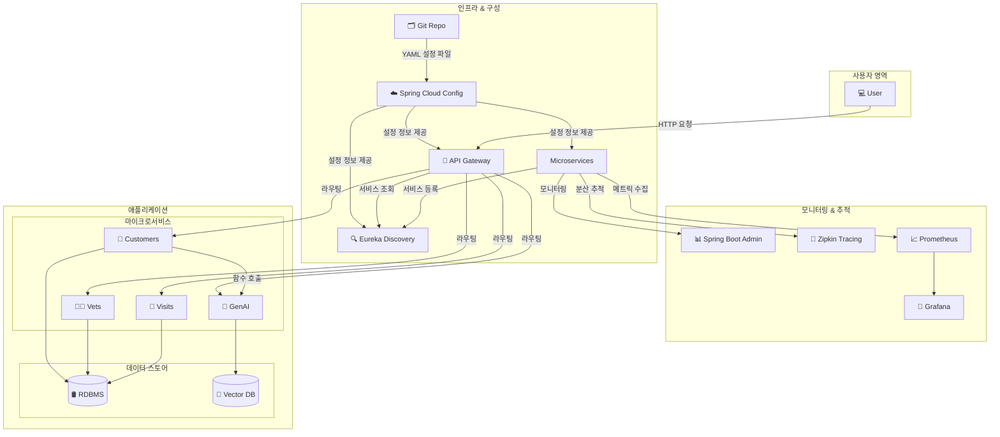

### 아키텍처 다이어그램 (Mermaid)

```mermaid
graph TD
    subgraph "사용자 영역"
        User[💻 User]
    end

    subgraph "인프라 & 구성"
        GitRepo[🗂️ Git Repo] --> |YAML 설정 파일| ConfigServer[☁️ Spring Cloud Config]
        ConfigServer --> |설정 정보 제공| DiscoveryServer[🔍 Eureka Discovery]
        ConfigServer --> |설정 정보 제공| ApiGateway
        ConfigServer --> |설정 정보 제공| Microservices
    end

    subgraph "모니터링 & 추적"
        AdminServer[📊 Spring Boot Admin]
        TracingServer[📝 Zipkin Tracing]
        Prometheus[📈 Prometheus]
        Grafana[🎨 Grafana]
    end

    subgraph "애플리케이션"
        ApiGateway[🚪 API Gateway]
        
        subgraph "마이크로서비스"
            direction LR
            CustomersService[👤 Customers]
            VetsService[👨‍⚕️ Vets]
            VisitsService[📅 Visits]
            GenAIService[🤖 GenAI]
        end
        
        subgraph "데이터 스토어"
            direction LR
            RDBMS[(🛢️ RDBMS)]
            VectorStore[(🧠 Vector DB)]
        end
    end

    %% --- 연결 정의 ---

    %% 사용자 -> 게이트웨이
    User -- "HTTP 요청" --> ApiGateway

    %% 게이트웨이 -> 마이크로서비스 (로드 밸런싱)
    ApiGateway -- "서비스 조회" --> DiscoveryServer
    ApiGateway -- "라우팅" --> CustomersService
    ApiGateway -- "라우팅" --> VetsService
    ApiGateway -- "라우팅" --> VisitsService
    ApiGateway -- "라우팅" --> GenAIService

    %% 마이크로서비스 -> 인프라
    Microservices -- "서비스 등록" --> DiscoveryServer
    Microservices -- "모니터링" --> AdminServer
    Microservices -- "분산 추적" --> TracingServer
    Microservices -- "메트릭 수집" --> Prometheus
    
    %% 마이크로서비스 -> 데이터 스토어
    CustomersService --> RDBMS
    VetsService --> RDBMS
    VisitsService --> RDBMS
    GenAIService --> VectorStore
    CustomersService -- "함수 호출" --> GenAIService

    %% 모니터링 대시보드
    Prometheus --> Grafana
```
