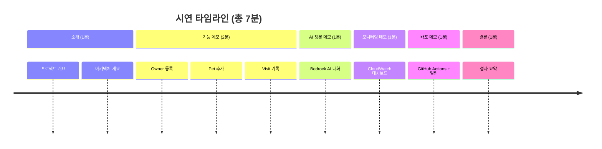

# Spring PetClinic AWS 마이그레이션 프로젝트 시연 계획

## 🎯 시연 개요
- **대상**: 학교 경진대회 발표
- **시간**: 5-10분
- **청중**: 교수, 학생, 심사위원
- **목표**: 마이크로서비스 아키텍처, AWS 클라우드 마이그레이션, DevOps 자동화, AI 통합을 효과적으로 시연

## 📊 시연 구조 및 시간 배분

## 🎬 상세 시연 시나리오

### 1. 소개 (1분)
**스크립트:**
"안녕하세요. 저희는 Spring PetClinic을 AWS 마이크로서비스로 마이그레이션한 프로젝트를 발표하겠습니다.

기존 모놀리식 애플리케이션을 4개 마이크로서비스로 분리하고, AWS 네이티브 서비스를 100% 활용했습니다."

**화면:** 프로젝트 아키텍처 다이어그램 표시

### 2. 애플리케이션 기능 데모 (2분)
**시나리오:** 반려동물 진료 예약 시스템 데모
- **Owner 등록:** 새로운 고객 정보 입력
- **Pet 추가:** 반려동물 정보 등록 (이름, 종류, 생년월일)
- **Visit 기록:** 진료 방문 기록 추가

**스크립트:**
"이제 실제 애플리케이션을 보여드리겠습니다. 고객 등록부터 시작합니다."

**포인트:** 각 기능이 독립된 마이크로서비스에서 처리됨을 언급

### 3. AI 챗봇 데모 (1분)
**시나리오:** Amazon Bedrock 기반 AI 챗봇
- 챗봇 아이콘 클릭
- "우리 강아지가 아파요. 어떻게 해야 하나요?" 질문
- AI 응답 확인

**스크립트:**
"저희 시스템에는 AI 챗봇이 통합되어 있습니다. Bedrock의 Claude 모델을 사용합니다."

**포인트:** 서버리스 Lambda로 구현된 AI 서비스 강조

### 4. 모니터링 데모 (1분)
**시나리오:** AWS CloudWatch 대시보드
- AWS 콘솔로 전환
- CloudWatch 대시보드 표시
- CPU/메모리 사용률, 요청 수, 에러율 확인

**스크립트:**
"실시간 모니터링을 위해 CloudWatch를 사용합니다. 현재 시스템 상태를 확인해보겠습니다."

**포인트:** 20개 자동 알람, Container Insights 강조

### 5. 배포 데모 (1분)
**시나리오:** CI/CD 파이프라인 데모
- GitHub에서 코드 푸시 시뮬레이션
- GitHub Actions 워크플로우 실행
- Slack/Email 알림 도착

**스크립트:**
"완전 자동화된 배포 파이프라인입니다. 코드 변경 시 10-15분 내에 배포 완료됩니다."

**포인트:** Infrastructure as Code (Terraform), 보안 스캔 (Trivy) 언급

### 6. 결론 (1분)
**스크립트:**
"저희 프로젝트의 주요 성과는:
- 마이크로서비스 아키텍처 성공적 구현
- AWS Well-Architected Framework 준수
- 월 $200 이내 비용 최적화
- 99.9% 고가용성 확보

감사합니다."

## 🔧 준비사항 체크리스트

### 사전 준비
- [ ] 애플리케이션 배포 완료 및 정상 동작 확인
- [ ] 데모용 테스트 데이터 준비 (샘플 Owner/Pet/Visit)
- [ ] AWS 콘솔 로그인 상태 유지
- [ ] CloudWatch 대시보드 접근 권한 확인
- [ ] GitHub Actions 워크플로우 준비 (테스트용 브랜치)
- [ ] 알림 채널 설정 (Slack/Email)

### 시연 당일 준비
- [ ] 노트북/모니터 연결 확인
- [ ] 인터넷 연결 안정성 확인
- [ ] 브라우저 시크릿 모드 준비 (캐시 문제 방지)
- [ ] AWS 콘솔 북마크 준비
- [ ] 타이머 준비 (시간 관리)

### 백업 플랜
- [ ] 네트워크 문제 시: 로컬 데모 환경 준비
- [ ] AWS 서비스 장애 시: 아키텍처 다이어그램으로 설명
- [ ] 시간 초과 시: 핵심 데모 (기능 + 모니터링)만 진행

## 💡 시연 팁

### 효과적인 발표를 위한 조언
1. **시간 엄수**: 각 섹션별 시간 철저히 지키기
2. **시각적 강조**: 화면 공유 시 확대/축소 적절히 사용
3. **설명 간결**: 기술 용어는 심사위원 수준으로 설명
4. **에너지 유지**: 경진대회인 만큼 열정적으로 발표
5. **Q&A 대비**: 예상 질문 준비
   - 비용은 얼마인가? (월 $130-250)
   - 왜 AWS를 선택했나? (확장성, 관리형 서비스)
   - 마이크로서비스 장점은? (독립 배포, 확장성)

### 기술적 강조 포인트
- **마이크로서비스**: 서비스별 독립 배포/확장
- **AWS 네이티브**: Spring Cloud → AWS 관리형 서비스 전환
- **비용 최적화**: 서버리스로 유휴 비용 제거
- **DevOps**: 완전 자동화 CI/CD 파이프라인
- **관측성**: CloudWatch + X-Ray + Container Insights

---

**작성일**: 2025-11-14
**버전**: 1.0
**다음 검토**: 시연 전날