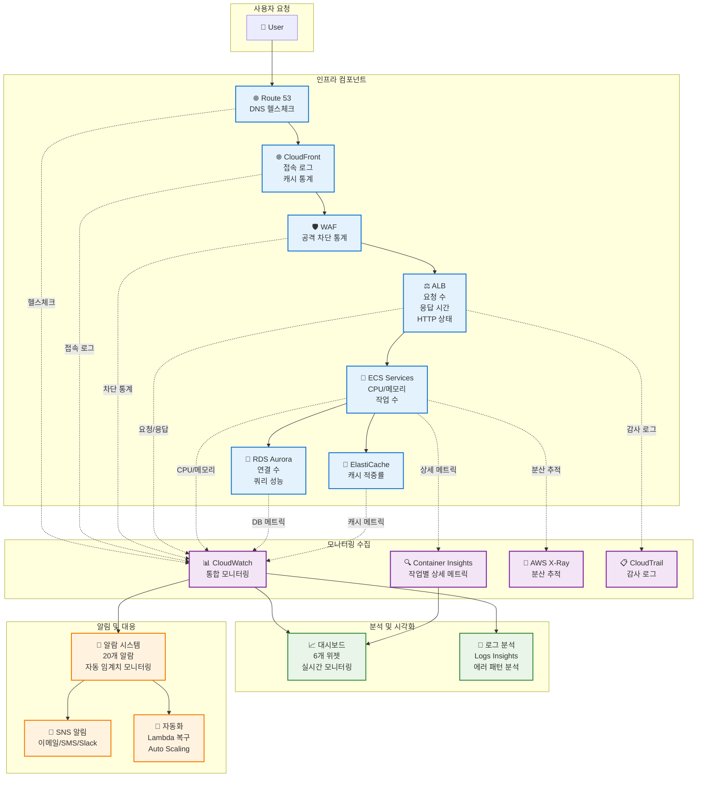

# 모니터링 아키텍처 다이어그램

## Draw.io Import용 Mermaid 코드



## Draw.io로 Import하는 방법

1. [draw.io](https://app.diagrams.net/) 웹사이트 열기
2. **File → Import → Mermaid...** 선택
3. 위의 Mermaid 코드를 복사해서 붙여넣기
4. **Import** 버튼 클릭
5. 다이어그램이 자동으로 생성됨

## 다이어그램 설명

### 🔵 파란색 (Infra): 인프라 컴포넌트
- 실제 AWS 서비스들
- 모니터링 데이터의 소스

### 🟣 보라색 (Monitor): 모니터링 수집
- CloudWatch, Container Insights 등
- 메트릭과 로그를 수집하는 서비스들

### 🟢 초록색 (Analysis): 분석 및 시각화
- 대시보드와 로그 분석
- 사람이 데이터를 이해하는 인터페이스

### 🟠 주황색 (Alert): 알림 및 대응
- 알람과 자동화 시스템
- 문제가 발생했을 때의 대응 메커니즘

## 주요 모니터링 메트릭

| 컴포넌트 | 주요 메트릭 | 임계치 알람 |
|---------|-------------|-------------|
| **ECS** | CPUUtilization, MemoryUtilization | >80% (5분) |
| **ALB** | RequestCount, TargetResponseTime | >3초 (5분) |
| **RDS** | DatabaseConnections, CPUUtilization | >80 (5분) |
| **WAF** | BlockedRequests, AllowedRequests | 공격 패턴 |

## 비용 구조

```
월간 모니터링 비용: $7.80
├── 알람 (20개): $2.00
├── 로그 수집 (5GB): $2.50
├── 로그 스토리지 (10GB): $0.30
└── Container Insights (6개): $3.00