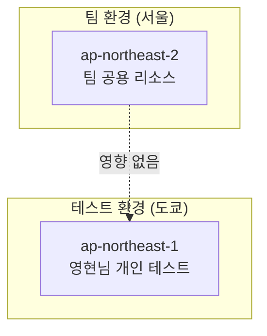

# Terraform 도쿄 리전 테스트 가이드

## 📋 개요

Spring PetClinic 마이크로서비스의 Terraform 인프라 코드를 도쿄 리전(`ap-northeast-1`)에서 안전하게 테스트하기 위한 종합 가이드입니다.

### 🎯 목적

- **팀 리소스 보호**: 서울 리전(ap-northeast-2) 팀 환경에 영향 없이 독립적 테스트
- **실제 검증**: 모의 테스트가 아닌 실제 AWS 리소스 생성/삭제로 완전한 검증
- **안전한 실험**: 개인 계정에서 언제든 생성/삭제 가능한 격리된 환경
- **비용 효율성**: 필요할 때만 생성하고 즉시 정리하여 비용 최소화

## 🏗️ 아키텍처 개요

### 리전 분리 전략



### 테스트 환경 구성

| 구분 | 팀 환경 (서울) | 테스트 환경 (도쿄) |
|------|----------------|-------------------|
| **리전** | ap-northeast-2 | ap-northeast-1 |
| **가용영역** | 2a, 2c | 1a, 1c |
| **네임 프리픽스** | petclinic-dev | petclinic-tokyo-test |
| **환경** | dev | test |
| **소유자** | team-petclinic | yeonghyeon |

## 🚀 빠른 시작

### 전제 조건

1. **AWS CLI 설정**
   ```bash
   aws configure --profile petclinic-yeonghyeon
   aws sts get-caller-identity --profile petclinic-yeonghyeon
   ```

2. **Terraform 설치**
   ```bash
   terraform --version  # >= 1.12.0 필요
   ```

### 자동화 스크립트 사용 (권장)

```bash
# 1. 전체 인프라 검증 (Plan만)
./scripts/tokyo-region-test.sh plan

# 2. 실제 리소스 생성
./scripts/tokyo-region-test.sh apply

# 3. 테스트 완료 후 정리
./scripts/tokyo-region-test.sh destroy
```

### 수동 레이어별 실행

```bash
# Network 레이어
cd terraform/envs/dev/network
terraform init
terraform plan -var-file="tokyo-test.tfvars"
terraform apply -var-file="tokyo-test.tfvars"

# Security 레이어
cd ../security
terraform init
terraform plan -var-file="tokyo-test.tfvars"
terraform apply -var-file="tokyo-test.tfvars"

# Database 레이어
cd ../database
terraform init
terraform plan -var-file="tokyo-test.tfvars"
terraform apply -var-file="tokyo-test.tfvars"

# Application 레이어
cd ../application
terraform init
terraform plan -var-file="tokyo-test.tfvars"
terraform apply -var-file="tokyo-test.tfvars"
```

## 📁 생성된 파일 구조

```
terraform/envs/dev/
├── network/tokyo-test.tfvars          # 네트워크 레이어 테스트 설정
├── security/tokyo-test.tfvars         # 보안 레이어 테스트 설정
├── database/tokyo-test.tfvars         # 데이터베이스 레이어 테스트 설정
└── application/tokyo-test.tfvars      # 애플리케이션 레이어 테스트 설정

scripts/
└── tokyo-region-test.sh               # 자동화 테스트 스크립트

terraform/
└── TOKYO_TEST_GUIDE.md               # 상세 테스트 가이드
```

## ⚙️ 설정 세부사항

### 공통 설정

```hcl
# 모든 레이어 공통
aws_region = "ap-northeast-1"           # 도쿄 리전
aws_profile = "petclinic-yeonghyeon"    # 영현님 프로필
name_prefix = "petclinic-tokyo-test"    # 테스트 식별
environment = "test"                    # 테스트 환경

# 테스트 태그
tags = {
  Purpose = "tokyo-region-test"
  Owner   = "yeonghyeon"
  TestEnv = "true"
}
```

### Network 레이어 특화 설정

```hcl
# 도쿄 리전 가용 영역
azs = ["ap-northeast-1a", "ap-northeast-1c"]

# 네트워크 CIDR (기본값 유지)
vpc_cidr = "10.0.0.0/16"
public_subnet_cidrs = ["10.0.1.0/24", "10.0.2.0/24"]
private_app_subnet_cidrs = ["10.0.3.0/24", "10.0.4.0/24"]
private_db_subnet_cidrs = ["10.0.5.0/24", "10.0.6.0/24"]

# 고가용성 설정
create_nat_per_az = true
enable_ipv6 = true
```

## 🔍 검증 체크리스트

### 1. Network 레이어 검증

- [ ] **VPC 생성**: 10.0.0.0/16 CIDR 블록
- [ ] **서브넷 생성**: 
  - Public: 10.0.1.0/24, 10.0.2.0/24
  - Private App: 10.0.3.0/24, 10.0.4.0/24
  - Private DB: 10.0.5.0/24, 10.0.6.0/24
- [ ] **게이트웨이**: Internet Gateway, NAT Gateway (각 AZ별)
- [ ] **라우팅**: 올바른 라우팅 테이블 설정
- [ ] **IPv6**: 듀얼스택 지원 확인

### 2. Security 레이어 검증

- [ ] **보안 그룹**: ALB, ECS, RDS용 보안 그룹 생성
- [ ] **IAM**: ECS 태스크 실행 역할 및 정책
- [ ] **VPC 엔드포인트**: ECR, CloudWatch, SSM 등
- [ ] **NACL**: Well-Architected Framework 준수 규칙

### 3. Database 레이어 검증

- [ ] **Aurora 클러스터**: Serverless v2 클러스터 생성
- [ ] **서브넷 그룹**: DB 서브넷 그룹 설정
- [ ] **보안**: Secrets Manager 통합
- [ ] **백업**: 자동 백업 설정

### 4. Application 레이어 검증

- [ ] **ECS**: Fargate 클러스터 및 서비스
- [ ] **ALB**: Application Load Balancer 설정
- [ ] **ECR**: 컨테이너 레지스트리
- [ ] **로깅**: CloudWatch 로그 그룹

## 💰 비용 관리

### 예상 비용 (시간당)

| 서비스 | 시간당 비용 | 설명 |
|--------|-------------|------|
| Aurora Serverless v2 | ~$0.50 | 최소 ACU 설정 |
| NAT Gateway (2개) | ~$0.18 | 각 AZ별 1개 |
| ALB | ~$0.05 | Application Load Balancer |
| ECS Fargate | ~$0.10 | 최소 구성 |
| **총 예상** | **~$0.83** | **약 $20/일** |

### 비용 절약 전략

1. **즉시 정리**: 테스트 완료 후 바로 `terraform destroy`
2. **선택적 테스트**: 필요한 레이어만 생성
3. **짧은 테스트**: 2-3시간 내 완료 목표
4. **리소스 모니터링**: AWS Cost Explorer로 비용 추적

## 🚨 주의사항 및 모범 사례

### 보안 고려사항

1. **프로필 확인**
   ```bash
   # 올바른 프로필 사용 확인
   aws sts get-caller-identity --profile petclinic-yeonghyeon
   ```

2. **리전 확인**
   ```bash
   # 도쿄 리전 서비스 가용성 확인
   aws ec2 describe-availability-zones --region ap-northeast-1
   ```

3. **상태 파일 관리**
   - 도쿄 테스트 상태 파일은 별도 경로 저장
   - 팀 상태 파일과 충돌 없음

### 운영 모범 사례

1. **테스트 전 계획**
   - 검증할 항목 미리 정의
   - 예상 소요 시간 계획
   - 롤백 계획 수립

2. **문제 해결 준비**
   ```bash
   # 부분적 destroy 시도
   terraform destroy -target=aws_instance.example
   
   # 상태 파일 확인
   terraform show
   
   # 리소스 수동 정리 (최후 수단)
   aws ec2 describe-instances --region ap-northeast-1
   ```

3. **결과 문서화**
   - 성공/실패 기록
   - 발견된 이슈 정리
   - 개선사항 제안

## 🔧 문제 해결 가이드

### 일반적인 문제들

#### 1. 권한 오류
```bash
# 해결 방법
aws configure --profile petclinic-yeonghyeon
aws sts get-caller-identity --profile petclinic-yeonghyeon
```

#### 2. 리전 서비스 제한
```bash
# 도쿄 리전 서비스 확인
aws service-quotas get-service-quota \
  --service-code ec2 \
  --quota-code L-1216C47A \
  --region ap-northeast-1
```

#### 3. 상태 파일 충돌
```bash
# 상태 파일 위치 확인
terraform show
terraform state list
```

#### 4. 네트워크 연결 문제
```bash
# VPC 연결성 확인
aws ec2 describe-vpcs --region ap-northeast-1
aws ec2 describe-route-tables --region ap-northeast-1
```

## 📊 테스트 시나리오

### 기본 시나리오: 전체 스택 테스트

```bash
# 1단계: 계획 검증
./scripts/tokyo-region-test.sh plan

# 2단계: 인프라 생성
./scripts/tokyo-region-test.sh apply

# 3단계: 연결성 테스트
# (수동으로 AWS 콘솔에서 확인)

# 4단계: 정리
./scripts/tokyo-region-test.sh destroy
```

### 고급 시나리오: 레이어별 점진적 테스트

```bash
# Network만 먼저 테스트
cd terraform/envs/dev/network
terraform apply -var-file="tokyo-test.tfvars"

# 성공 시 Security 추가
cd ../security
terraform apply -var-file="tokyo-test.tfvars"

# 단계별 진행...
```

## 🎉 성공 후 다음 단계

### 1. 결과 공유
- 팀에 테스트 결과 공유
- 발견된 이슈나 개선사항 보고
- 성공 사례 문서화

### 2. 서울 리전 적용
- 검증된 설정을 팀 환경에 적용
- 점진적 롤아웃 계획 수립
- 모니터링 및 알림 설정

### 3. 지속적 개선
- 테스트 자동화 개선
- 비용 최적화 방안 적용
- 문서 업데이트

## 📚 관련 문서

- [Terraform TOKYO_TEST_GUIDE.md](../terraform/TOKYO_TEST_GUIDE.md) - 상세 기술 가이드
- [AWS_PROFILE_STRATEGY.md](../terraform/AWS_PROFILE_STRATEGY.md) - 프로필 전략
- [VALIDATION_GUIDE.md](../terraform/VALIDATION_GUIDE.md) - 검증 가이드
- [To-Be 아키텍처 설계](../.kiro/steering/to_be_infra_architecture.md) - 목표 아키텍처

---

**작성자**: 영현님  
**최종 업데이트**: 2025년 10월 4일  
**상태**: 검증 대기 중 (Terraform 코드 검증 완료 후 실행 예정)

> 💡 **팁**: 테스트 전에 반드시 `terraform plan`으로 변경사항을 확인하고, 테스트 완료 후에는 즉시 `terraform destroy`로 리소스를 정리하세요!