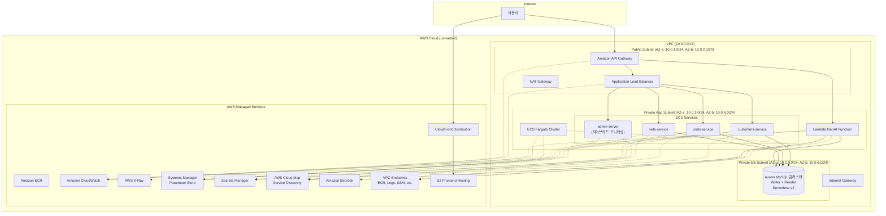

# To-Be 아키텍처 인프라 설계서

태그: 일정별 할일
상태: 완료
작성자: 황영현
카테고리: 일정

# Spring PetClinic 마이크로서비스 AWS 클라우드 마이그레이션 To-Be 아키텍처 설계서

## 1. 개요

본 문서는 Spring PetClinic 마이크로서비스의 AWS 클라우드 마이그레이션 목표 아키텍처(To-Be)를 정의한 종합 설계 문서입니다. 현재 구축된 기본 인프라(VPC, ECS Fargate, Aurora, ALB)를 기반으로 AWS 네이티브 관리형 서비스로의 완전한 마이그레이션과 인프라 검증 체계를 포함합니다.

**프로젝트 범위:**

- AWS 네이티브 서비스 마이그레이션 (Spring Cloud → AWS 관리형 서비스)
- Terraform 인프라 검증 및 테스트 체계 구축
- 운영 효율성과 확장성 극대화

**설계 목표:**

- 고가용성, 확장성, 보안성 확보
- 비용 효율적 운영 (서버리스 우선)
- 운영 자동화 및 모니터링 체계 구축
- 인프라 안정성 검증 체계 확립

**대상 리전:** us-west-2 (오레건) / ap-northeast-2 (서울)

## 2. AWS Well-Architected Framework 적용 원칙

### 2.1. 운영 우수성 (Operational Excellence)

- **IaC (Infrastructure as Code):** Terraform을 사용하여 모든 인프라를 코드로 관리, 재현성과 확장성 확보
- **CI/CD 자동화:** GitHub Actions를 통한 빌드, 테스트, 배포 자동화
- **모니터링 및 로깅:** CloudWatch를 통한 중앙 집중식 모니터링, 로그 분석으로 운영 효율성 향상

### 2.2. 보안 (Security)

- **네트워크 격리:** VPC를 통한 네트워크 분리, Public/Private Subnet 구분
- **최소 권한 원칙:** IAM 역할 및 정책으로 필요한 권한만 부여
- **데이터 보호:** 전송 중/저장 시 암호화, Secrets Manager를 통한 민감 정보 관리

### 2.3. 안정성 (Reliability)

- **Multi-AZ 배포:** 2개 이상의 가용 영역 사용으로 고가용성 확보
- **Auto Scaling:** ECS 서비스의 CPU/메모리 기반 자동 확장
- **장애 복구:** RDS Multi-AZ, 백업 및 복원 전략

### 2.4. 성능 효율성 (Performance Efficiency)

- **서버리스 컴퓨팅:** ECS Fargate를 통한 서버 관리 부담 제거
- **로드 밸런싱:** ALB를 통한 트래픽 분산 및 헬스체크
- **모니터링 기반 최적화:** CloudWatch 메트릭을 통한 성능 모니터링 및 튜닝

### 2.5. 비용 최적화 (Cost Optimization)

- **관리형 서비스 활용:** EC2 대신 Fargate, Aurora Serverless v2 등 관리형 서비스 사용으로 운영 비용 절감
- **사용량 기반 과금:** 서버리스 모델로 실제 사용량만큼 비용 지불
- **모니터링 및 최적화:** Cost Explorer를 통한 비용 분석 및 리소스 Right-sizing

### 2.6. 지속 가능성 (Sustainability)

- **리소스 효율성:** 서버리스 아키텍처로 유휴 리소스 최소화
- **탄소 발자국 감소:** AWS의 지속 가능한 인프라 활용

## 3. VPC 및 네트워킹 설계

### 3.1. VPC 구성

- **VPC CIDR:** 10.0.0.0/16 (IPv4)
- **가용 영역:** us-west-2a, us-west-2b (2개 AZ)
- **DNS 호스트 이름 활성화:** 예 (VPC 내 리소스 간 DNS 해석)

### 3.2. Subnet 설계

| Subnet 유형 | AZ | CIDR | 용도 | 라우팅 |
| --- | --- | --- | --- | --- |
| Public | us-west-2a | 10.0.1.0/24 | ALB, NAT Gateway | IGW |
| Public | us-west-2b | 10.0.2.0/24 | ALB, NAT Gateway | IGW |
| Private App | us-west-2a | 10.0.3.0/24 | ECS, Lambda | NAT Gateway |
| Private App | us-west-2b | 10.0.4.0/24 | ECS, Lambda | NAT Gateway |
| Private DB | us-west-2a | 10.0.5.0/24 | Aurora | No IGW |
| Private DB | us-west-2b | 10.0.6.0/24 | Aurora | No IGW |

### 3.3. 게이트웨이 및 라우팅

- **Internet Gateway (IGW):** Public Subnet의 인터넷 접근용
- **NAT Gateway:** Private App Subnet의 IPv4 아웃바운드 인터넷 접근 (업데이트, ECR Pull 등)
- **Route Table:**
    - Public RT: 0.0.0.0/0 -> IGW
    - Private App RT: 0.0.0.0/0 -> NAT Gateway
    - Private DB RT: 로컬 라우트만 (인터넷 경로 없음)

### 3.4. 보안 그룹 (Security Groups)

- **ALB SG:** 80, 443 포트 인바운드 허용 (0.0.0.0/0), ECS SG로 아웃바운드
- **ECS SG:** ALB SG로부터 8080, 9090 포트 인바운드, Aurora SG로 아웃바운드
- **Aurora SG:** ECS SG로부터 3306 포트 인바운드 (MySQL)
- **Lambda SG:** Aurora 접근을 위한 3306 포트 아웃바운드

## 4. 컴퓨팅 설계 (ECS Fargate + Lambda)

### 4.1. ECS 클러스터

- **클러스터 이름:** petclinic-dev-cluster
- **런타임:** Fargate
- **용량 공급자:** FARGATE, FARGATE_SPOT (비용 최적화)

### 4.2. ECS 서비스 및 태스크 (AWS 네이티브 서비스로 최적화)

| 서비스 | 태스크 수 | CPU | 메모리 | Auto Scaling | 헬스체크 | 비고 |
| --- | --- | --- | --- | --- | --- | --- |
| customers-service | 1 | 256 | 512 | CPU 70% | /api/customers/actuator/health | 핵심 비즈니스 서비스 |
| vets-service | 1 | 256 | 512 | CPU 70% | /api/vets/actuator/health | 핵심 비즈니스 서비스 |
| visits-service | 1 | 256 | 512 | CPU 70% | /api/visits/actuator/health | 핵심 비즈니스 서비스 |
| admin-server | 1 | 256 | 512 | CPU 70% | /admin/actuator/health | 하이브리드 모니터링 (개발/디버깅용) |

**AWS 네이티브 서비스로 대체된 컴포넌트:**

- ~~api-gateway~~ → **AWS API Gateway** (관리형 서비스)
- ~~config-server~~ → **AWS Systems Manager Parameter Store** (관리형 서비스)
- ~~discovery-server~~ → **AWS Cloud Map** (관리형 서비스)
- ~~genai-service~~ → **Amazon Bedrock + Lambda** (완전 서버리스)

### 4.3. 태스크 정의

- **네트워크 모드:** awsvpc
- **로그 드라이버:** awslogs (CloudWatch Logs)
- **환경 변수:** Parameter Store/Secrets Manager에서 주입

## 5. 로드 밸런싱 및 라우팅 설계

### 5.1. Application Load Balancer (ALB)

- **유형:** Application Load Balancer (Internet-facing)
- **서브넷:** Public Subnets (2개)
- **리스너:** 80 (HTTP → 443 리다이렉션), 443 (HTTPS, ACM 인증서)
- **타겟 그룹:** 각 서비스별로 생성, 헬스체크 경로: /actuator/health
- **라우팅 규칙:** 경로 기반 라우팅 (/api/customers/*, /api/vets/*, /api/visits/*, /admin/*)

### 5.2. AWS API Gateway (관리형 서비스)

- **유형:** REST API (HTTP API로 업그레이드 고려)
- **엔드포인트 유형:** Regional
- **인증:** 없음 (개발용), 추후 Cognito 연동 가능
- **스로틀링:** 1000 req/sec (조정 가능)
- **통합:** ALB로 HTTP_PROXY 통합, Lambda로 AWS_PROXY 통합
- **장점:**
    - 완전 관리형 서비스 (서버 관리 불필요)
    - 자동 스케일링 및 고가용성
    - 내장 모니터링 및 로깅
    - 요청/응답 변환 기능
- **비용:** 요청당 과금 모델

## 6. AWS 네이티브 서비스 설계

### 6.1. AWS Systems Manager Parameter Store (설정 관리)

**Spring Cloud Config Server 대체**

- **계층적 구조:** `/petclinic/dev/customers/database.url`
- **암호화:** SecureString 타입으로 민감 정보 보호
- **버전 관리:** 설정 변경 이력 추적
- **통합:** Spring Cloud AWS를 통한 자동 설정 주입
- **비용:** 표준 파라미터 무료, 고급 파라미터 유료

**설정 구조 예시:**

```
/petclinic/dev/
├── db/
│   ├── url = "jdbc:mysql://aurora-endpoint:3306/petclinic?useSSL=false&allowPublicKeyRetrieval=true"
│   ├── username = "petclinic"
│   └── secrets-manager-name = "arn:aws:secretsmanager:us-west-2:897722691159:secret:rds-db-credentials/petclinic"
├── customers/server.port = "8080"
├── vets/server.port = "8080"
├── visits/server.port = "8080"
└── admin/server.port = "8080"
```

### 6.2. AWS Cloud Map (서비스 디스커버리)

**Netflix Eureka 대체**

- **네임스페이스:** `petclinic.local` (프라이빗 DNS)
- **서비스 등록:** ECS 서비스 자동 등록 (customers, vets, visits, admin)
- **헬스체크:** ECS 헬스체크와 통합
- **DNS 기반:** 표준 DNS 쿼리로 서비스 발견
- **비용:** 등록된 서비스 인스턴스당 과금

**서비스 등록 예시:**

```
ECS 서비스 (Cloud Map 등록):
customers.petclinic.local    → ECS 태스크 IP들
vets.petclinic.local        → ECS 태스크 IP들
visits.petclinic.local      → ECS 태스크 IP들
admin.petclinic.local       → ECS 태스크 IP들
```

### 6.3. Amazon Bedrock + Lambda (AI 서비스)

**기존 GenAI ECS 서비스 대체**

- **아키텍처:** API Gateway → Lambda Function → Amazon Bedrock
- **모델:** Claude 3 Haiku (빠르고 비용 효율적)
- **Lambda 설정:** Python 3.11, 512MB 메모리, 60초 타임아웃
- **장점:** 완전 관리형, 서버리스, 사용량 기반 과금, Cold Start 최소화

**Well-Architected Framework 관점:**

```yaml
운영 우수성: ✅ 서버리스, 자동 스케일링, 모니터링 내장
보안: ✅ API 키 보호, IAM 역할, VPC 통신
안정성: ✅ 자동 재시도, DLQ, 에러 처리
성능 효율성: ⚖️ Cold Start 있지만 Provisioned Concurrency로 해결
비용 최적화: ✅ 요청당 과금, 유휴 비용 없음, 무료 티어
```

### 6.4. AWS Secrets Manager (민감 정보 관리)

- **DB 비밀번호:** 자동 생성 및 관리
- **자동 로테이션:** 30일 주기 (선택사항)
- **암호화:** AWS KMS 키 사용
- **ECS 통합:** 태스크 정의에서 직접 참조
- **감사:** CloudTrail을 통한 접근 로그

## 7. 데이터베이스 설계 (Aurora 클러스터)

### 7.1. Aurora MySQL 클러스터 구성

- **엔진:** Aurora MySQL 8.0.mysql_aurora.3.08.0 (MySQL 8.0 호환)
- **클러스터 구성:** Writer 1개 + Reader 1개
- **배포 위치:** Private DB Subnet (Multi-AZ)
- **스토리지:** Aurora 자동 관리
- **백업:** 자동 백업 7일 보관, Point-in-Time Recovery

### 7.2. Aurora Serverless v2 설정

- **ACU (Aurora Capacity Unit) 범위:** 0.5 - 1.0 ACU (개발 환경)
- **자동 스케일링:** 트래픽에 따라 동적 조정
- **비용 최적화:** 사용하지 않을 때 최소 용량 유지
- **성능:** RDS MySQL 대비 향상된 성능

### 7.3. 논리적 데이터베이스 분리

각 마이크로서비스별로 독립적인 데이터베이스 운영:

```sql
-- 서비스별 데이터베이스 생성
CREATE DATABASE petclinic_customers;  -- 고객 및 반려동물 정보
CREATE DATABASE petclinic_vets;       -- 수의사 정보
CREATE DATABASE petclinic_visits;     -- 방문 및 예약 정보
```

### 7.4. 엔드포인트 구조

- **클러스터 엔드포인트 (Writer):** 쓰기 작업 전용, 자동 failover 지원
- **Reader 엔드포인트:** 읽기 작업 전용, 부하 분산
- **개별 인스턴스 엔드포인트:** 특정 인스턴스 직접 접근 (디버깅용)

### 7.5. 고가용성 및 장애 복구

- **Multi-AZ 배포:** us-west-2a, us-west-2b
- **자동 Failover:** Writer 장애 시 Reader가 자동으로 승격
- **백업 전략:**
    - 자동 백업: 매일 백업 윈도우 (03:00-04:00 UTC)
    - 스냅샷: 주요 배포 전 수동 스냅샷 생성
    - 복제: Cross-Region 백업 (재해 복구용, 선택사항)

### 7.6. 보안 설정

- **암호화:** 저장 시 암호화 (AWS KMS 키 사용)
- **전송 중 암호화:** SSL/TLS 강제
- **접근 제어:** VPC 내부에서만 접근 가능
- **인증:** IAM 데이터베이스 인증 + 전통적인 사용자/비밀번호
- **비밀번호 관리:** AWS Secrets Manager 통합

## 8. 보안 설계

### 8.1. IAM 역할 및 정책

- **ECS 태스크 실행 역할:** ECR Pull, CloudWatch Logs 생성, Secrets Manager 읽기
- **ECS 태스크 역할:** Parameter Store 읽기, X-Ray 쓰기, CloudWatch 메트릭 쓰기
- **Lambda 실행 역할:** Bedrock 호출, RDS Data API 접근, Secrets Manager 읽기
- **API Gateway 역할:** ALB 호출 권한

### 8.2. VPC 엔드포인트 (현재 구현 완료)

**프라이빗 서브넷에서 AWS 서비스 안전 접근**

- **ECR API/DKR:** Docker 이미지 Pull
- **CloudWatch Logs:** 로그 전송
- **SSM/Secrets Manager:** 설정 및 비밀 정보 접근
- **KMS:** 암호화 키 관리
- **Monitoring:** CloudWatch 메트릭 전송
- **X-Ray:** 분산 추적 데이터 전송

### 8.3. 네트워크 ACL (NACL)

- **Public Subnet NACL:** HTTP/HTTPS 인바운드 허용, 에페메랄 포트 아웃바운드
- **Private App Subnet NACL:** ALB 타겟 포트 8080, 9090 인바운드, VPC 엔드포인트 통신 허용
- **Private DB Subnet NACL:** Private App CIDR에서 3306 인바운드, 제한적 아웃바운드

### 8.4. 데이터 암호화

- **Aurora:** 저장 시 암호화 (KMS 키 사용), 전송 중 SSL/TLS
- **Secrets Manager:** AWS KMS 키로 암호화
- **Parameter Store:** SecureString 타입으로 암호화
- **전송 중:** ALB에서 HTTPS 강제, VPC 엔드포인트 TLS
- **백업:** 암호화된 스냅샷 및 백업

## 9. 모니터링 및 관측성 설계

### 9.1. CloudWatch (현재 구현 완료)

- **메트릭:** CPU, 메모리, 네트워크, ALB 요청 수, Aurora 성능 메트릭
- **로그:** 모든 ECS 서비스 로그를 CloudWatch Logs로 중앙 수집
- **알람:** CPU 80%, 메모리 80%, ALB 5xx 에러, Aurora 연결 수 임계값 시 알림
- **Container Insights:** ECS 클러스터에 활성화하여 상세 메트릭 수집

### 9.2. AWS 네이티브 서비스 모니터링

- **API Gateway:** 요청 수, 지연시간, 에러율 자동 모니터링
- **Parameter Store:** 파라미터 접근 로그 (CloudTrail)
- **Cloud Map:** 서비스 등록/해제 이벤트 (ECS 서비스만)
- **Secrets Manager:** 시크릿 접근 및 로테이션 로그
- **Lambda (AI):** 실행 시간, 에러율, 동시 실행 수, Cold Start 메트릭
- **Bedrock:** 모델 호출 수, 토큰 사용량, 응답 시간

### 9.3. Aurora 모니터링

- **Performance Insights:** 데이터베이스 성능 분석 및 최적화
- **Enhanced Monitoring:** 실시간 OS 메트릭 수집
- **CloudWatch 메트릭:** 연결 수, CPU 사용률, 읽기/쓰기 지연시간

### 9.4. AWS X-Ray (현재 구현 완료)

- **트레이싱:** 각 서비스에 X-Ray SDK 통합
- **서비스 맵:** 마이크로서비스 간 호출 추적
- **데이터베이스 추적:** Aurora 쿼리 성능 추적
- **API Gateway 통합:** API 호출 추적

## 10. 아키텍처 다이어그램



## 11. Terraform 모듈 구조 및 실행 방법

### 11.1. 현재 구현된 레이어 구조

**레이어 기반 아키텍처:**

- **01-network:** VPC, 서브넷, 라우팅, 게이트웨이, VPC 엔드포인트
- **02-security:** 보안 그룹, IAM 역할, NACL, VPC 엔드포인트 보안
- **03-database:** Aurora MySQL 클러스터, Secrets Manager
- **04-parameter-store:** 애플리케이션 설정 관리 (Config Server 대체)
- **05-cloud-map:** 서비스 디스커버리 (Eureka 대체)
- **06-lambda-genai:** AI 서비스 (GenAI ECS 대체)
- **07-application:** ECS 클러스터, 서비스, ALB, ECR
- **08-api-gateway:** API Gateway (Spring Cloud Gateway 대체)
- **09-aws-native:** AWS 서비스 통합
- **10-monitoring:** CloudWatch 대시보드, CloudTrail
- **11-frontend:** S3 + CloudFront 프론트엔드 호스팅
- **12-notification:** Slack 알림 시스템

### 11.2. AWS 네이티브 서비스 구현 계획

### API Gateway 구성

```yaml
API Gateway 설정:
  타입: REST API
  엔드포인트 타입: Regional
  스테이지: dev
  스로틀링: 1000 req/sec
  라우팅:
    /api/customers/* → ALB/customers-service
    /api/vets/* → ALB/vets-service
    /api/visits/* → ALB/visits-service
    /api/genai/* → Lambda/genai-function
    /admin/* → ALB/admin-server
```

### Parameter Store 설정 (config-server 대체)

```bash
# AWS CLI로 파라미터 생성
aws ssm put-parameter \\
  --name "/petclinic/dev/db/url" \\
  --value "jdbc:mysql://aurora-endpoint:3306/petclinic?useSSL=false&allowPublicKeyRetrieval=true" \\
  --type "String"

aws ssm put-parameter \\
  --name "/petclinic/dev/db/username" \\
  --value "petclinic" \\
  --type "String"
```

### Cloud Map 네임스페이스 생성 (discovery-server 대체)

```bash
# 프라이빗 DNS 네임스페이스 생성 (ECS 서비스용)
aws servicediscovery create-private-dns-namespace \\
  --name "petclinic.local" \\
  --vpc "vpc-xxxxxxxxx"
```

### Lambda + Bedrock 구성 (AI 서비스 대체)

```yaml
Lambda 함수:
  런타임: Python 3.11
  메모리: 512MB
  타임아웃: 60초
  환경 변수:
    BEDROCK_MODEL_ID: "anthropic.claude-3-haiku-20240307-v1:0"
    AWS_REGION: "us-west-2"
    DB_CLUSTER_ARN: "aurora-cluster-arn"
    DB_SECRET_ARN: "secrets-manager-arn"
```

### 11.4. 팀 역할 분담

- **Network & Infrastructure:** 영현 (프로젝트 총괄, 인프라 설계(IaC), CI/CD 구축, VPC, Subnet, Gateway, 기반 네트워크 인프라, 리팩토링)
- **Security & Compliance:** 휘권 (IAM, Security Groups, VPC 엔드포인트, 보안 정책)
- **Database & Migration:** 준제 (Aurora 클러스터, 데이터 마이그레이션)
- **Application & Deployment:** 석겸 (ECS, ALB)

## 12. 설계 결정 근거 및 트레이드오프

### 12.1. AWS 네이티브 서비스 선택

- **Parameter Store vs Config Server:**
    - 장점: 완전 관리형, 암호화 지원, 비용 효율적, IAM 통합
    - 단점: Spring Cloud Config의 고급 기능 제한 (Git 통합, 프로파일 등)
    - 근거: 운영 복잡성 감소 및 AWS 생태계 통합
- **Cloud Map vs Eureka:**
    - 장점: DNS 기반 표준, ECS 네이티브 통합, 서버 관리 불필요
    - 단점: Eureka의 고급 기능 제한 (클라이언트 사이드 로드밸런싱 등)
    - 근거: 표준 DNS 기반으로 벤더 종속성 감소
- **API Gateway vs Spring Cloud Gateway:**
    - 장점: 완전 관리형, 자동 스케일링, 내장 모니터링, 요청당 과금
    - 단점: Spring 생태계 통합 제한, 커스텀 필터 복잡성
    - 근거: 운영 부담 제거 및 AWS 보안 기능 활용

### 12.2. Aurora Serverless v2 선택

- **장점:** 자동 스케일링, 비용 효율성, RDS 대비 향상된 성능
- **단점:** 초기 설정 복잡성, Cold Start 가능성
- **대안 고려:** RDS MySQL (더 단순하지만 확장성 제한) - 학습 및 성능 목적으로 Aurora 선택

### 12.3. ECS Fargate 선택

- **장점:** 서버 관리 불필요, Auto Scaling 용이, 비용 효율적
- **단점:** Cold Start 가능성 (하지만 PetClinic은 트래픽이 낮아 영향 적음)
- **대안 고려:** EKS (더 복잡하지만 확장성 높음) - 학습 목적으로 ECS 선택

### 12.4. VPC 엔드포인트 활용

- **장점:** 프라이빗 서브넷에서 AWS 서비스 안전 접근, NAT Gateway 비용 절감
- **단점:** 초기 설정 복잡성, 엔드포인트당 시간당 과금
- **근거:** 보안 강화 및 네트워크 트래픽 최적화

### 12.5. 논리적 데이터베이스 분리

- **장점:** 마이크로서비스 원칙 준수, 서비스 간 데이터 격리
- **단점:** 트랜잭션 복잡성 증가, 조인 쿼리 제한
- **근거:** 마이크로서비스 아키텍처의 독립성 확보

## 13. 예상 비용 및 최적화 방안

### 13.1. 월간 예상 비용 (AWS 네이티브 서비스 포함)

- **ECS Fargate:** $20-40 (태스크 수, 사용량에 따라)
- **ALB:** $20
- **Aurora Serverless v2:** $40-80 (ACU 사용량에 따라)
- **API Gateway:** $5-15 (요청 수에 따라)
- **Lambda (AI):** $5-20 (사용량 기반)
- **Parameter Store:** $0-5 (표준 파라미터 무료)
- **Cloud Map:** $5-10 (서비스 인스턴스당)
- **VPC 엔드포인트:** $15-25 (엔드포인트당 시간당 과금)
- **CloudWatch:** $10-20
- **Secrets Manager:** $5-10
- **S3 + CloudFront:** $5-15
- **총계:** $130-250 (최적화 전)

### 13.2. 비용 최적화 방안

- **Fargate Spot:** 50-70% 비용 절감
- **Aurora Serverless v2:** 트래픽 기반 자동 스케일링으로 비용 최적화
- **API Gateway HTTP API:** REST API 대비 70% 비용 절감
- **Parameter Store 표준 파라미터:** 무료 티어 활용
- **VPC 엔드포인트 최적화:** 필수 서비스만 선택적 구성
- **Auto Scaling:** 유휴 리소스 최소화
- **Cost Allocation Tags:** 서비스별 비용 추적
- **Reserved Capacity:** 장기 사용 시 예약 용량 구매 고려

### 13.3. AWS 네이티브 서비스의 비용 효율성

- **운영 비용 절감:** 서버 관리, 패치, 모니터링 인력 비용 제거
- **자동 스케일링:** 사용량에 따른 동적 비용 조정
- **관리 오버헤드 제거:** Spring Cloud 서비스 운영 비용 절약

## 14. 구현 로드맵 및 검증 계획

### 14.1. 현재 구현 완료 항목 ✅

- **기본 인프라:** VPC, 서브넷, 라우팅, 게이트웨이 (Network Layer)
- **보안 설정:** 보안 그룹, IAM 역할, VPC 엔드포인트 (Security Layer)
- **데이터베이스:** Aurora Serverless v2 클러스터, Secrets Manager (Database Layer)
- **설정 관리:** Parameter Store (Parameter Store Layer)
- **서비스 디스커버리:** Cloud Map (Cloud Map Layer)
- **AI 서비스:** Lambda + Bedrock (Lambda GenAI Layer)
- **애플리케이션:** ECS Fargate, ALB, ECR (Application Layer)
- **API 관리:** API Gateway (API Gateway Layer)
- **통합:** AWS 서비스 통합 (AWS Native Layer)
- **모니터링:** CloudWatch 대시보드, CloudTrail (Monitoring Layer)
- **프론트엔드:** S3 + CloudFront (Frontend Layer)
- **알림:** Slack 알림 시스템 (Notification Layer)

### 14.2. AWS 네이티브 마이그레이션 구현 계획 ✅ (완료)

- **API Gateway 구성:** REST API 생성 및 ALB/Lambda 통합
- **Parameter Store 설정:** 계층적 파라미터 구조 생성
- **Cloud Map 서비스 디스커버리:** 프라이빗 DNS 네임스페이스 생성
- **Lambda + Bedrock 구성:** AI Lambda 함수 생성 및 Bedrock 통합
- **WAF 및 보안:** Rate Limiting 및 보안 규칙 적용

### Phase 2: 애플리케이션 마이그레이션 (계획)

- **의존성 변경:** Spring Cloud → AWS SDK로 변경
- **점진적 배포:** 카나리 배포 전략 적용
- **모니터링 및 검증:** 각 단계별 성능 및 안정성 검증

### Phase 3: 레거시 제거 (계획)

- **Spring Cloud 컴포넌트 제거:** config-server, discovery-server 서비스 제거
- **genai-service ECS 제거:** Lambda + Bedrock으로 완전 전환
- **불필요한 리소스 정리:** 사용하지 않는 EC2, ELB 등 정리

### 14.3. 인프라 검증 및 테스트 계획

### 코드 품질 검증 (CI/CD로 구현됨 + Aqua trivy)

```yaml
검증 도구:
  terraform fmt: 코드 포맷팅 표준화
  terraform validate: 구문 및 설정 검증
  tfsec: Terraform 보안 정적 분석
  checkov: 인프라 보안 및 컴플라이언스 검사
```

### 레이어별 검증

- **Network Layer 검증:** VPC CIDR, 서브넷, 라우팅, 게이트웨이 확인
- **Security Layer 검증:** 보안 그룹, IAM 정책, VPC 엔드포인트 검증
- **Database Layer 검증:** Aurora 클러스터, Multi-AZ, 백업 설정 확인
- **Application Layer 검증:** ECS 서비스, ALB 라우팅, 헬스체크 확인

### 성능 및 보안 테스트

```yaml
성능 테스트:
  부하 테스트: Apache Bench, JMeter
  응답 시간: P95 < 500ms
  처리량: 1000 req/sec
  가용성: 99.9% 이상

보안 테스트:
  침투 테스트: 무단 접근 차단 확인
  암호화 검증: 전송 중/저장 시 암호화
  IAM 정책: 최소 권한 원칙 준수
```

### 14.4. 모니터링 및 하이브리드 전략

### CloudWatch 중심 모니터링 (프로덕션)

```yaml
핵심 모니터링:
  메트릭 수집: CloudWatch Container Insights
  로그 관리: CloudWatch Logs
  알람 설정: CloudWatch Alarms
  대시보드: CloudWatch Dashboard
```

### Admin Server 보완 역할 (개발/디버깅)

```yaml
개발 편의 기능:
  실시간 로그 레벨 변경
  JVM 메트릭 상세 조회
  Actuator 엔드포인트 통합 UI
  개발자 친화적 인터페이스
```

### 14.5. 비용 최적화 및 예상 비용

### 월간 예상 비용 (AWS 네이티브 서비스 포함)

```yaml
서버리스 우선 아키텍처:
  ECS Fargate: $20-40 (AI 서비스 Lambda 전환으로 감소)
  ALB: $20
  Aurora Serverless v2: $40-80
  API Gateway: $5-15 (요청 수에 따라)
  Lambda (AI): $5-20 (사용량 기반)
  Parameter Store: $0-5 (표준 파라미터 무료)
  Cloud Map: $5-10
  VPC 엔드포인트: $15-25
  CloudWatch: $10-20
  Secrets Manager: $5-10
  S3 + CloudFront: $5-15
  총계: $130-250 (기존 대비 10-20% 절감)
```

### 비용 최적화 방안

- **Fargate Spot:** 50-70% 비용 절감
- **Lambda 서버리스:** AI 서비스 유휴 비용 제거
- **Parameter Store 표준 파라미터:** 무료 티어 활용
- **Auto Scaling:** 유휴 리소스 최소화

### 14.6. 지속적 개선 계획

### 정기 검증 및 모니터링

```yaml
정기 검증:
  일일: 기본 상태 확인 및 메트릭 모니터링
  주간: 성능 및 보안 검증
  월간: 전체 인프라 감사 및 비용 최적화

드리프트 감지:
  실시간: Terraform 상태 모니터링
  자동 복구: 설정 드리프트 자동 수정
```

### 문서화 및 운영 가이드

- **최종 아키텍처 문서:** 완성된 To-Be 아키텍처 상세 문서
- **운영 가이드:** 일상 운영 및 장애 대응 절차
- **개발자 가이드:** 새로운 서비스 추가 및 배포 방법
- **비용 최적화 가이드:** 지속적인 비용 관리 방안

본 설계는 AWS Well-Architected Framework를 기반으로 하여 운영, 보안, 안정성, 성능, 비용, 지속 가능성 측면에서 균형을 맞추었으며, 현재 구축된 인프라를 최대한 활용하면서 AWS 네이티브 서비스의 장점을 극대화하는 방향으로 구성되었습니다.