# Spring PetClinic AWS Architecture Diagram

## 전체 아키텍처 개요 (us-west-2)

```mermaid
graph TB
    %% 외부 사용자
    User([👤 Users])
    
    %% CloudFront & S3 (Frontend)
    CF[☁️ CloudFront Distribution]
    S3[📦 S3 Bucket<br/>Frontend Static Files]
    
    %% Internet Gateway
    IGW[🌐 Internet Gateway]
    
    %% API Gateway
    APIGW[🚪 API Gateway<br/>REST API<br/>Replaces: Spring Cloud Gateway]
    
    %% VPC
    subgraph VPC["🏢 VPC (10.0.0.0/16)"]
        
        %% Public Subnet Zone
        subgraph Public["🌍 Public Subnets (Multi-AZ)"]
            ALB[⚖️ Application Load Balancer<br/>Port 80/443]
            NAT_A[🔄 NAT Gateway<br/>AZ-a]
            NAT_B[🔄 NAT Gateway<br/>AZ-b]
        end
        
        %% Private App Subnet Zone
        subgraph PrivateApp["🔒 Private App Subnets (Multi-AZ)"]
            
            subgraph ECS["📦 ECS Fargate Cluster"]
                CUSTOMERS[🐕 customers-service<br/>CPU: 256, Mem: 512]
                VETS[👨‍⚕️ vets-service<br/>CPU: 256, Mem: 512]
                VISITS[📅 visits-service<br/>CPU: 256, Mem: 512]
                ADMIN[🛠️ admin-server<br/>CPU: 256, Mem: 512<br/>Monitoring]
            end
            
            LAMBDA[⚡ Lambda Function<br/>GenAI Service<br/>Python 3.11<br/>Replaces: GenAI ECS]
            
            VPCE[🔌 VPC Endpoints<br/>ECR, Logs, SSM<br/>Secrets, KMS, X-Ray]
        end
        
        %% Private DB Subnet Zone
        subgraph PrivateDB["🗄️ Private DB Subnets (Multi-AZ)"]
            AURORA_W[(💾 Aurora MySQL<br/>Writer Instance<br/>Serverless v2<br/>ACU: 0.5-1.0)]
            AURORA_R[(💾 Aurora MySQL<br/>Reader Instance<br/>Serverless v2<br/>Read Replica)]
        end
    end
    
    %% AWS Managed Services
    subgraph AWS["☁️ AWS Managed Services"]
        PARAM[⚙️ Systems Manager<br/>Parameter Store<br/>Replaces: Config Server]
        CLOUDMAP[🗺️ AWS Cloud Map<br/>Service Discovery<br/>Replaces: Eureka]
        BEDROCK[🤖 Amazon Bedrock<br/>Claude 3 Haiku<br/>AI/ML Service]
        SECRETS[🔐 Secrets Manager<br/>DB Credentials]
        CW[📊 CloudWatch + X-Ray<br/>Monitoring & Tracing]
        ECR[📦 Amazon ECR<br/>Container Registry]
    end
    
    %% User Flow
    User -->|HTTPS| CF
    CF --> S3
    User -->|API Requests| APIGW
    
    %% API Gateway Routing
    APIGW -->|/api/customers<br/>/api/vets<br/>/api/visits<br/>/admin| ALB
    APIGW -->|/api/genai| LAMBDA
    
    %% Internet Gateway
    IGW --> ALB
    
    %% Load Balancer to Services
    ALB -->|Path Routing| CUSTOMERS
    ALB -->|Path Routing| VETS
    ALB -->|Path Routing| VISITS
    ALB -->|Path Routing| ADMIN
    
    %% ECS Services to Database
    CUSTOMERS -->|MySQL 3306| AURORA_W
    VETS -->|MySQL 3306| AURORA_W
    VISITS -->|MySQL 3306| AURORA_W
    
    %% Lambda to Services
    LAMBDA -->|Bedrock API| BEDROCK
    LAMBDA -->|MySQL 3306| AURORA_W
    
    %% Aurora Replication
    AURORA_W -.->|Replication| AURORA_R
    
    %% ECS to AWS Services
    CUSTOMERS -.->|Config| PARAM
    VETS -.->|Config| PARAM
    VISITS -.->|Config| PARAM
    ADMIN -.->|Config| PARAM
    
    CUSTOMERS -.->|Discovery| CLOUDMAP
    VETS -.->|Discovery| CLOUDMAP
    VISITS -.->|Discovery| CLOUDMAP
    ADMIN -.->|Discovery| CLOUDMAP
    
    CUSTOMERS -.->|Secrets| SECRETS
    VETS -.->|Secrets| SECRETS
    VISITS -.->|Secrets| SECRETS
    LAMBDA -.->|Secrets| SECRETS
    
    %% Monitoring
    CUSTOMERS -.->|Logs & Metrics| CW
    VETS -.->|Logs & Metrics| CW
    VISITS -.->|Logs & Metrics| CW
    ADMIN -.->|Logs & Metrics| CW
    LAMBDA -.->|Logs & Metrics| CW
    ALB -.->|Metrics| CW
    AURORA_W -.->|Metrics| CW
    
    %% VPC Endpoints
    ECS -.->|Private Link| VPCE
    LAMBDA -.->|Private Link| VPCE
    
    %% Container Images
    ECS -.->|Pull Images| ECR
    
    %% NAT Gateway for outbound
    ECS -.->|Outbound| NAT_A
    ECS -.->|Outbound| NAT_B
    LAMBDA -.->|Outbound| NAT_A

    %% Styling
    classDef frontend fill:#e3f2fd,stroke:#1976d2,stroke-width:2px
    classDef compute fill:#fff3e0,stroke:#ff9800,stroke-width:2px
    classDef database fill:#e8eaf6,stroke:#3f51b5,stroke-width:2px
    classDef network fill:#f3e5f5,stroke:#9c27b0,stroke-width:2px
    classDef managed fill:#e8f5e9,stroke:#4caf50,stroke-width:2px
    classDef lambda fill:#ffe0b2,stroke:#ff6f00,stroke-width:2px
    
    class CF,S3 frontend
    class CUSTOMERS,VETS,VISITS,ADMIN compute
    class AURORA_W,AURORA_R database
    class ALB,IGW,NAT_A,NAT_B network
    class PARAM,CLOUDMAP,BEDROCK,SECRETS,CW,ECR,APIGW managed
    class LAMBDA lambda
```



## 주요 구성 요소

### 1. Frontend Layer
- **CloudFront + S3**: 정적 웹사이트 호스팅 (CDN 글로벌 배포)

### 2. API Gateway Layer
- **API Gateway**: 단일 진입점, 경로 기반 라우팅
  - `/api/*` → ALB → ECS Services
  - `/api/genai/*` → Lambda Function
  - **대체**: Spring Cloud Gateway

### 3. Network Layer (VPC: 10.0.0.0/16)
- **Public Subnets** (10.0.1.0/24, 10.0.2.0/24)
  - Application Load Balancer
  - NAT Gateways (각 AZ)
  
- **Private App Subnets** (10.0.3.0/24, 10.0.4.0/24)
  - ECS Fargate Services
  - Lambda Functions
  - VPC Endpoints
  
- **Private DB Subnets** (10.0.5.0/24, 10.0.6.0/24)
  - Aurora MySQL Cluster (Multi-AZ)

### 4. Compute Layer
- **ECS Fargate Cluster**
  - `customers-service`: 고객 및 반려동물 관리
  - `vets-service`: 수의사 정보 관리
  - `visits-service`: 방문 및 예약 관리
  - `admin-server`: 모니터링 (하이브리드 접근)
  
- **Lambda Function**
  - GenAI Service (Python 3.11)
  - Amazon Bedrock 통합
  - **대체**: GenAI ECS Service

### 5. Database Layer
- **Aurora MySQL Serverless v2**
  - Writer Instance (Primary)
  - Reader Instance (Read Replica)
  - ACU Range: 0.5 - 1.0
  - Multi-AZ 고가용성

### 6. AWS Managed Services

#### Configuration Management
- **Systems Manager Parameter Store**
  - 계층적 설정 관리 (`/petclinic/dev/*`)
  - **대체**: Spring Cloud Config Server

#### Service Discovery
- **AWS Cloud Map**
  - DNS 기반 서비스 디스커버리
  - ECS 네이티브 통합
  - **대체**: Netflix Eureka

#### AI/ML Service
- **Amazon Bedrock**
  - Claude 3 Haiku 모델
  - Lambda 통합

#### Security & Secrets
- **AWS Secrets Manager**
  - DB 자격증명 자동 관리
  - 자동 로테이션 (30일)

#### Monitoring & Observability
- **CloudWatch**
  - 로그 중앙 집중화
  - 메트릭 및 알람
  - Container Insights
  
- **AWS X-Ray**
  - 분산 추적
  - 서비스 맵

#### Container Registry
- **Amazon ECR**
  - Docker 이미지 저장소
  - 각 서비스별 리포지토리

## Network Flow

### Inbound Traffic Flow
```
User → CloudFront → S3 (Static Files)
User → API Gateway → ALB → ECS Services
User → API Gateway → Lambda → Bedrock
```

### Service-to-Service Communication
```
ECS Services → Cloud Map (Service Discovery)
ECS Services → Parameter Store (Configuration)
ECS Services → Secrets Manager (Credentials)
ECS Services → Aurora (Database)
```

### Outbound Traffic Flow
```
ECS Services → NAT Gateway → Internet (Updates, API calls)
Lambda → NAT Gateway → Internet (Bedrock API)
ECS/Lambda → VPC Endpoints → AWS Services (Private)
```

## Security Architecture

### Network Security
- **Security Groups**: 최소 권한 원칙
  - ALB SG: 80, 443 허용
  - ECS SG: ALB에서만 8080, 9090 허용
  - Aurora SG: ECS/Lambda에서만 3306 허용
  
- **Network ACLs**: Subnet 레벨 방화벽
- **VPC Endpoints**: Private Link를 통한 AWS 서비스 접근

### Access Control
- **IAM Roles**: ECS Task Execution Role, Lambda Execution Role
- **IAM Policies**: 최소 권한 부여
- **Secrets Manager**: 자격증명 암호화 저장

### Data Protection
- **전송 중 암호화**: HTTPS/TLS (ALB, API Gateway)
- **저장 시 암호화**: Aurora (KMS), S3, Secrets Manager

## High Availability & Disaster Recovery

### Multi-AZ Deployment
- **Compute**: ECS tasks across 2 AZs
- **Database**: Aurora Multi-AZ (Writer + Reader)
- **Network**: NAT Gateway per AZ

### Auto Scaling
- **ECS Services**: CPU 70% 기준 자동 확장 (1-4 tasks)
- **Aurora**: Serverless v2 자동 ACU 조정 (0.5-1.0)

### Backup & Recovery
- **Aurora**: 자동 백업 (7일 보관)
- **Point-in-Time Recovery**: 최근 5분까지 복구 가능

## Cost Optimization

### Serverless Architecture
- **Lambda**: 실행 시간만큼만 과금
- **Aurora Serverless v2**: 사용량 기반 ACU 과금
- **API Gateway**: 요청당 과금

### Managed Services
- **운영 비용 절감**: 서버 관리 불필요
- **자동 스케일링**: 유휴 리소스 최소화

### Expected Monthly Cost
- ECS Fargate: $20-40
- Aurora Serverless v2: $40-80
- API Gateway: $5-15
- Lambda: $5-20
- Other Services: $30-50
- **Total**: ~$130-250/month

## Monitoring Strategy

### CloudWatch Monitoring
- **Container Insights**: ECS 클러스터 상세 메트릭
- **Log Groups**: 서비스별 로그 분리
- **Alarms**: CPU, Memory, Error Rate 모니터링

### X-Ray Tracing
- **Service Map**: 마이크로서비스 간 호출 추적
- **Performance**: 레이턴시 및 병목 지점 분석

### Admin Server (Hybrid)
- **Development/Debug**: 실시간 로그 레벨 변경
- **Actuator Integration**: Spring Boot 메트릭 통합 UI

## Terraform Layer Architecture

### Infrastructure as Code (12 Layers)
1. **01-network**: VPC, Subnets, Gateways, VPC Endpoints
2. **02-security**: Security Groups, IAM Roles, NACLs
3. **03-database**: Aurora MySQL Cluster, Secrets Manager
4. **04-parameter-store**: Application Configuration
5. **05-cloud-map**: Service Discovery
6. **06-lambda-genai**: AI Service (Lambda + Bedrock)
7. **07-application**: ECS Cluster, Services, ALB, ECR
8. **08-api-gateway**: API Gateway Configuration
9. **09-aws-native**: AWS Services Integration
10. **10-monitoring**: CloudWatch Dashboards, Alarms
11. **11-frontend**: S3 + CloudFront
12. **12-notification**: Slack Notifications

### Deployment Workflow
```bash
# 순차적 레이어 배포
terraform apply -target=module.01-network
terraform apply -target=module.02-security
terraform apply -target=module.03-database
# ... 나머지 레이어
```

## Well-Architected Framework Alignment

### ✅ Operational Excellence
- Infrastructure as Code (Terraform)
- CI/CD Automation (GitHub Actions)
- Centralized Monitoring (CloudWatch)

### ✅ Security
- Network Isolation (VPC, Subnets)
- Least Privilege (IAM)
- Encryption (Transit & At-Rest)

### ✅ Reliability
- Multi-AZ Deployment
- Auto Scaling
- Automatic Failover

### ✅ Performance Efficiency
- Serverless Computing (Fargate, Lambda)
- Load Balancing (ALB)
- Monitoring-based Optimization

### ✅ Cost Optimization
- Managed Services
- Usage-based Pricing
- Auto Scaling

### ✅ Sustainability
- Resource Efficiency (Serverless)
- Minimal Idle Resources

---

**Architecture Version**: 1.0  
**Last Updated**: 2025-11-13  
**Region**: us-west-2 (Oregon)  
**Environment**: Development