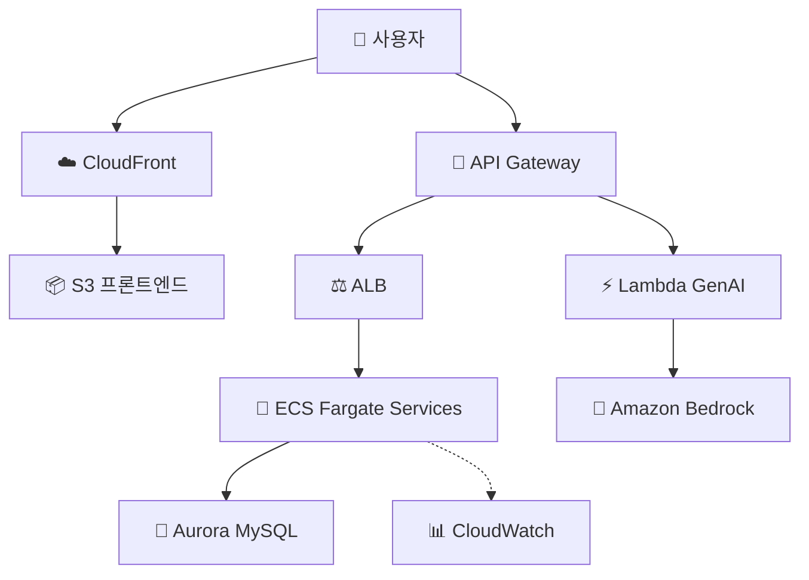

# Spring PetClinic AWS 마이그레이션 프로젝트 PPT 구성 제안

## 🎯 프로젝트 개요
- **프로젝트명**: Spring PetClinic 마이크로서비스 AWS 마이그레이션
- **목적**: 기존 모놀리식 애플리케이션을 마이크로서비스로 분리하고 AWS 클라우드로 마이그레이션
- **대상**: 학교 경진대회 발표
- **청중**: 교수, 학생, 심사위원 (기술적 배경 다양)

## 📊 PPT 구조 (총 16-20 슬라이드)

### 1. 타이틀 슬라이드
- 프로젝트 제목
- 팀원 이름
- 학교/학과 정보
- 발표 날짜

### 2. 목차
- 프로젝트 소개
- 기존 시스템 분석
- 목표 아키텍처
- 마이그레이션 전략
- 기술 스택
- 아키텍처 세부사항
- CI/CD 파이프라인
- 보안 및 모니터링
- 비용 분석
- 도전 과제 및 해결
- 성과 및 데모
- 결론
- Q&A

### 3. 프로젝트 소개 (2-3 슬라이드)

**슬라이드 3: 프로젝트 개요**
```
🎯 프로젝트명: Spring PetClinic 마이크로서비스 AWS 마이그레이션
🏢 수행 기간: 2025년 1학기
👥 팀 구성: 4명 (인프라, 백엔드, 프론트엔드, DevOps)
🎓 학과: 컴퓨터공학과
```

**핵심 내용:**
- **Spring PetClinic**: Spring Framework의 대표 샘플 애플리케이션
- **반려동물 진료 관리 시스템**: 고객, 수의사, 진료 예약, 방문 기록 관리
- **교육적 가치**: 실제 기업 환경과 유사한 복잡한 시스템
- **현실성**: GitHub Star 7.8K+의 널리 사용되는 오픈소스 프로젝트

**슬라이드 4: 프로젝트 배경 및 동기**
```
❓ 왜 이 프로젝트를 선택했나?

📈 산업 트렌드:
• 클라우드 컴퓨팅 도입률 급증 (기업의 90% 이상)
• 마이크로서비스 아키텍처 표준화
• DevOps 및 IaC(Infrastructure as Code) 필수화

🎓 교육적 목표:
• 최신 클라우드 기술 실습
• 팀 협업 및 프로젝트 관리 경험
• 실무 적용 가능한 기술 스택 습득

💡 혁신적 접근:
• 기존 모놀리식 → 마이크로서비스 전환
• 온프레미스 → AWS 클라우드 마이그레이션
• 수동 배포 → 완전 자동화 CI/CD
```

**슬라이드 5: 프로젝트 목표**
```
🎯 주요 목표 (SMART 기준)

1. 마이크로서비스 아키텍처 구현
   • 4개 독립 서비스로 분리 (고객, 수의사, 방문, 관리)
   • 각 서비스별 독립 배포 및 확장

2. AWS 네이티브 서비스 100% 활용
   • Spring Cloud → AWS 관리형 서비스 전환
   • 서버리스 컴퓨팅 도입 (Lambda, Fargate)

3. 완전 자동화된 DevOps 파이프라인
   • GitHub Actions 기반 CI/CD
   • Infrastructure as Code (Terraform)
   • 모니터링 및 로깅 자동화

4. 기업 수준 고가용성 확보
   • Multi-AZ 배포로 99.9% 가용성
   • 자동 확장 및 장애 복구
   • 보안 및 컴플라이언스 준수

5. 비용 효율적 운영
   • 서버리스로 유휴 비용 제거
   • Auto Scaling으로 수요 맞춤 조정
   • 월 $200 이내 예산 목표
```

### 4. 기존 시스템 분석 (As-Is) (1 슬라이드)
**슬라이드 6: 기존 아키텍처**
```
🐕 Spring PetClinic (모놀리식)
├── Spring Boot 애플리케이션
├── H2/MySQL 데이터베이스
├── 단일 JAR 배포
└── 로컬 개발 환경
```
- 장점: 단순성, 빠른 개발
- 단점: 확장성 부족, 배포 위험성, 기술 스택 고정

### 5. 목표 아키텍처 (To-Be) (2-3 슬라이드)
**슬라이드 7: 전체 아키텍처 개요**
```
🌐 사용자 → API Gateway → ECS Services → Aurora DB
                    ↓
               Lambda (AI) → Bedrock
```

**슬라이드 8: 마이크로서비스 구성**
- customers-service: 고객 및 반려동물 관리
- vets-service: 수의사 정보 관리
- visits-service: 진료 예약 및 기록
- admin-server: 모니터링 대시보드
- genai-service: AI 채팅 기능 (Lambda)

**슬라이드 9: AWS 아키텍처 다이어그램**


### 6. 마이그레이션 전략 (1 슬라이드)
**슬라이드 10: 마이그레이션 접근 방식**
- 단계적 마이그레이션: 모놀리식 → 마이크로서비스
- AWS 네이티브 서비스 우선: Spring Cloud → AWS 관리형 서비스
- Infrastructure as Code: Terraform 레이어 기반 배포
- 테스트 주도 마이그레이션: 각 단계별 검증

### 7. 기술 스택 (1 슬라이드)
**슬라이드 11: 기술 스택 비교**
| 컴포넌트 | 기존 (As-Is) | 신규 (To-Be) |
|----------|-------------|-------------|
| 애플리케이션 | Spring Boot (모놀리식) | Spring Boot (마이크로서비스) |
| 데이터베이스 | H2/MySQL | Aurora MySQL Serverless v2 |
| 배포 | JAR 파일 | ECS Fargate + ECR |
| 서비스 디스커버리 | - | AWS Cloud Map |
| 설정 관리 | application.yml | Parameter Store |
| API 게이트웨이 | - | API Gateway |
| AI 서비스 | - | Lambda + Bedrock |
| 인프라 | 수동 | Terraform |
| CI/CD | - | GitHub Actions |

### 8. 아키텍처 세부사항 (2 슬라이드)
**슬라이드 12: 네트워크 아키텍처**
- VPC: 10.0.0.0/16 (Multi-AZ)
- Public Subnets: ALB, NAT Gateway
- Private App Subnets: ECS, Lambda
- Private DB Subnets: Aurora
- 보안: Security Groups, NACLs, VPC Endpoints

**슬라이드 13: 컴퓨팅 및 데이터**
- ECS Fargate: 서버리스 컨테이너
- Aurora Serverless v2: 자동 스케일링 DB
- Lambda: 이벤트 기반 AI 서비스
- 고가용성: Multi-AZ 배포

### 9. CI/CD 파이프라인 (1 슬라이드)
**슬라이드 14: 자동화된 배포**
```
Git Push → GitHub Actions → 테스트 → 빌드 → ECR 푸시 → ECS 업데이트 → 헬스체크
```
- 빌드 시간: 10-15분
- 자동 테스트: 단위/통합 테스트
- 보안 스캔: Trivy, SonarQube
- 롤백 지원: 이전 버전 유지

### 10. 보안 및 모니터링 (1 슬라이드)
**슬라이드 15: 보안 및 관측성**
- 보안: IAM, VPC 격리, 암호화, WAF
- 모니터링: CloudWatch, X-Ray, Container Insights
- 로깅: 중앙 집중식 로그 관리
- 알람: CPU/메모리 임계값 모니터링

### 11. 비용 분석 (1 슬라이드)
**슬라이드 16: 비용 최적화**
- 월 예상 비용: $130-250
- 서버리스 절감: 사용량 기반 과금
- 주요 비용: ECS Fargate, Aurora, API Gateway
- 최적화: Fargate Spot, Auto Scaling

### 12. 도전 과제 및 해결 (1 슬라이드)
**슬라이드 17: 주요 도전 과제**
- 마이크로서비스 복잡성 관리
- AWS 서비스 학습 곡선
- 인프라 코드 관리
- **해결**: Terraform 모듈화, 팀 협업, 단계적 접근

### 13. 성과 및 데모 (1 슬라이드)
**슬라이드 18: 프로젝트 성과**
- ✅ 완전 자동화된 배포 파이프라인
- ✅ AWS Well-Architected Framework 준수
- ✅ 고가용성 Multi-AZ 아키텍처
- ✅ 서버리스 비용 최적화
- 데모: 실제 서비스 동작 화면

### 14. 결론 (1 슬라이드)
**슬라이드 19: 프로젝트 의미**
- 현대적 클라우드 아키텍처 구현
- DevOps 문화 정착
- 확장 가능하고 유지보수 가능한 시스템 구축
- 실무 적용 가능한 기술 스택 습득

### 15. Q&A (1 슬라이드)
**슬라이드 20: 질문과 답변**
- 준비된 Q&A:
  - 왜 AWS를 선택했나? (확장성, 관리형 서비스)
  - 마이크로서비스 장점은? (독립 배포, 확장성)
  - 비용은 어느 정도? (월 $130-250)
  - 보안은 어떻게? (VPC 격리, IAM, 암호화)

## 🎯 발표 팁
- **시간 배분**: 소개 2분, 본론 8분, 결론 2분, Q&A 3분
- **시각적 강조**: 다이어그램과 차트 활용
- **스토리텔링**: 문제 → 해결 → 결과 구조
- **에너지 유지**: 경진대회이니 열정적으로 발표

## 📝 참고 자료
- 프로젝트 GitHub: [링크]
- AWS 아키텍처 문서: docs/ 폴더
- Terraform 코드: terraform/ 폴더

---
**작성일**: 2025-11-13
**대상**: 학교 경진대회 발표