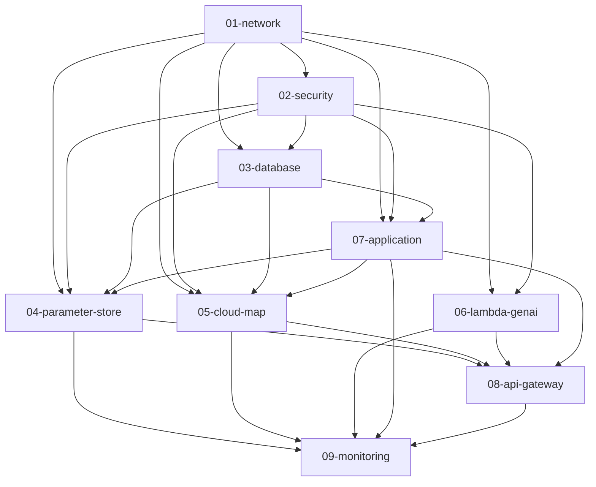

# PetClinic Dev 환경 - Terraform 레이어 의존성 관리

## 개요

이 디렉토리는 PetClinic 애플리케이션의 개발 환경을 위한 Terraform 레이어들을 포함하고 있습니다. 각 레이어는 특정 책임을 가지며, 의존성 관계에 따라 순차적으로 배포되어야 합니다.

**중요**: 배포 및 검증은 `terraform/scripts/` 디렉토리의 스크립트를 사용하세요.

## 레이어 구조

### 기본 인프라 레이어
- **01-network**: VPC, 서브넷, 게이트웨이, VPC 엔드포인트
- **02-security**: 보안 그룹, IAM 역할, 정책
- **03-database**: Aurora MySQL 클러스터
- **07-application**: ECS Fargate, ALB, ECR

### AWS 네이티브 서비스 레이어
- **04-parameter-store**: Parameter Store (Spring Cloud Config 대체)
- **05-cloud-map**: Cloud Map (Eureka 대체)
- **06-lambda-genai**: Lambda + Bedrock (GenAI 서비스)
- **08-api-gateway**: API Gateway (Spring Cloud Gateway 대체)
- **09-monitoring**: CloudWatch 통합 모니터링

## 의존성 관계



## 배포 순서

1. **Phase 1**: `01-network` (기본 네트워크 인프라)
2. **Phase 2**: `02-security` (보안 설정)
3. **Phase 3**: `03-database` (데이터베이스)
4. **Phase 4**: `07-application` (애플리케이션 인프라)
5. **Phase 5**: `04-parameter-store`, `05-cloud-map`, `06-lambda-genai` (AWS 네이티브 서비스)
6. **Phase 6**: `08-api-gateway`, `09-monitoring` (통합 및 모니터링)

## 사용법

### 1. 전체 레이어 순차 배포

```bash
# 프로젝트 루트에서 실행
cd terraform

# dev 환경 모든 레이어 배포
./scripts/apply-all.sh dev

# staging 환경 배포
./scripts/apply-all.sh staging

# prod 환경 배포
./scripts/apply-all.sh prod
```

### 2. 의존성 검증

```bash
# dev 환경 모든 레이어 의존성 검증
./scripts/validate-dependencies.sh -a dev

# staging 환경 검증
./scripts/validate-dependencies.sh -a staging

# 의존성 그래프 보기
./scripts/validate-dependencies.sh -g

# 권장 배포 순서 보기
./scripts/validate-dependencies.sh -o
```

### 3. 개별 레이어 작업

```bash
# 특정 레이어 디렉토리에서 작업
cd envs/dev/01-network

# 초기화
terraform init

# 계획
terraform plan -var-file=dev.tfvars

# 적용
terraform apply -var-file=dev.tfvars
```

## 파일 구조

```
terraform/envs/dev/
├── README.md                    # 이 파일
├── dependencies.tf              # 중앙 의존성 관리
├── shared-data-sources.tf       # 공유 데이터 소스 정의
├── shared-variables.tf          # 공통 변수 정의
├── deploy-layers.sh             # 레이어 배포 스크립트
├── validate-dependencies.sh     # 의존성 검증 스크립트
├── Makefile                     # Make 명령어 정의
├── 01-network/                  # Network 레이어
│   ├── main.tf
│   ├── variables.tf
│   ├── outputs.tf
│   ├── backend.tf
│   └── dev.tfvars
├── 02-security/                 # Security 레이어
├── 03-database/                 # Database 레이어
├── 04-parameter-store/          # Parameter Store 레이어
├── 05-cloud-map/               # Cloud Map 레이어
├── 06-lambda-genai/            # Lambda GenAI 레이어
├── 07-application/             # Application 레이어
├── 08-api-gateway/             # API Gateway 레이어
└── 09-monitoring/              # Monitoring 레이어
```

## 스크립트 사용법

### 배포 스크립트 (`terraform/scripts/apply-all.sh`)
- **목적**: AWS Well-Architected 원칙에 따른 안전한 순차 배포
- **특징**: 의존성 검증, 상세 로깅, 에러 처리
- **사용법**: `./scripts/apply-all.sh [환경]`

### 검증 스크립트 (`terraform/scripts/validate-dependencies.sh`)
- **목적**: 레이어 간 의존성 및 상태 검증
- **특징**: 순환 의존성 감지, 상태 확인, 그래프 시각화
- **사용법**: `./scripts/validate-dependencies.sh [옵션] [환경]`

## 중요 사항

### 1. 배포 전 확인사항
- AWS CLI가 설정되어 있고 올바른 프로파일을 사용하는지 확인
- Terraform 상태 파일을 저장할 S3 버킷과 DynamoDB 테이블이 존재하는지 확인
- 각 레이어의 `dev.tfvars` 파일이 올바르게 설정되어 있는지 확인

### 2. 의존성 관리
- 레이어는 반드시 의존성 순서대로 배포해야 합니다
- 상위 레이어를 삭제하기 전에 하위 레이어를 먼저 삭제해야 합니다
- `validate-dependencies.sh`를 사용하여 의존성을 검증하세요

### 3. 상태 관리
- 각 레이어는 독립적인 Terraform 상태를 가집니다
- 상태 파일은 S3에 원격으로 저장되며 DynamoDB로 잠금 관리됩니다
- 레이어 간 데이터 공유는 `terraform_remote_state` 데이터 소스를 통해 이루어집니다

### 4. 문제 해결
- 배포 실패 시 로그 파일(`logs/` 디렉토리)을 확인하세요
- 의존성 문제가 있을 경우 `validate-dependencies.sh`를 실행하세요
- 상태 불일치 문제가 있을 경우 `terraform refresh`를 실행하세요

## AWS 네이티브 마이그레이션

이 구조는 Spring Cloud 컴포넌트를 AWS 네이티브 서비스로 마이그레이션하는 것을 목표로 합니다:

| Spring Cloud 컴포넌트 | AWS 네이티브 서비스 | 레이어 |
|---------------------|-------------------|--------|
| Spring Cloud Config | Parameter Store | 04-parameter-store |
| Netflix Eureka | Cloud Map | 05-cloud-map |
| GenAI ECS Service | Lambda + Bedrock | 06-lambda-genai |
| Spring Cloud Gateway | API Gateway | 08-api-gateway |

## 지원 및 문의

- 네트워크 레이어: 영현 (yeonghyeon)
- 보안 레이어: 휘권 (hwigwon)  
- 데이터베이스 레이어: 준제 (junje)
- 애플리케이션 레이어: 석겸 (seokgyeom)
- AWS 네이티브 서비스: 팀 공동 작업