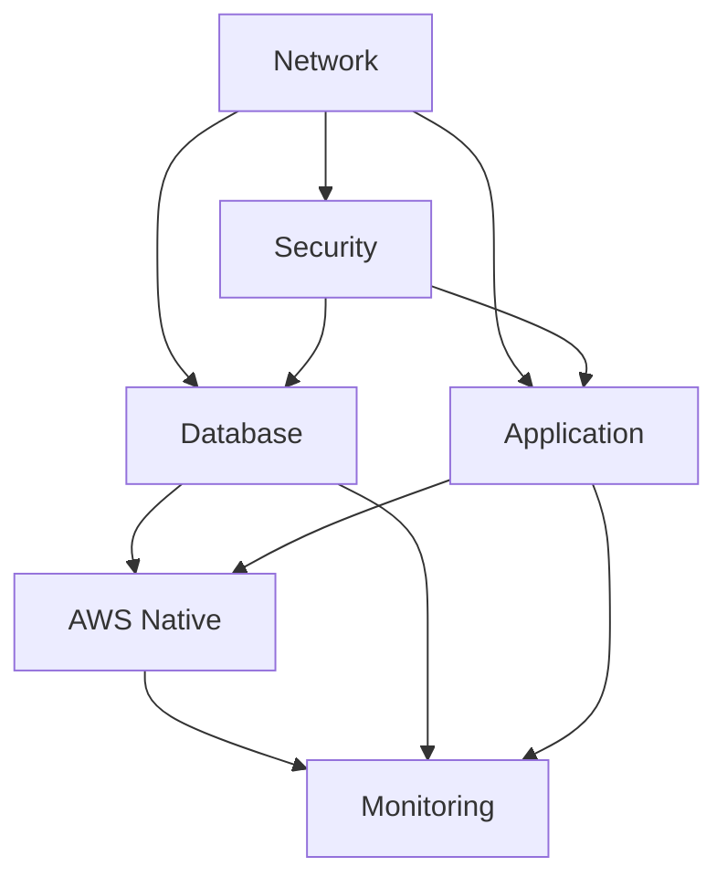

# PetClinic Dev Environment - Terraform 실행 가이드

## 🏗️ 클린 아키텍처 레이어 구조

```
terraform/envs/dev/
├── 1. network/         # 기반 인프라 (VPC, Subnet, Gateway)
├── 2. security/        # 보안 설정 (Security Groups, IAM, VPC Endpoints)
├── 3. database/        # 데이터 레이어 (Aurora MySQL)
├── 4. application/     # 애플리케이션 레이어 (ECS, ALB, ECR)
├── 5. aws-native/      # AWS 네이티브 서비스 (API Gateway, Parameter Store, Cloud Map, Lambda)
└── 6. monitoring/      # 관측성 레이어 (CloudWatch, X-Ray, CloudTrail)
```

## 📋 실행 순서 (의존성 기반)

### 1단계: 기반 인프라
```bash
# Network 레이어 (VPC, 서브넷, 게이트웨이)
cd terraform/envs/dev/network
terraform init && terraform apply

# Security 레이어 (보안 그룹, IAM, VPC 엔드포인트)
cd ../security
terraform init && terraform apply
```

### 2단계: 데이터 레이어
```bash
# Database 레이어 (Aurora MySQL)
cd ../database
terraform init && terraform apply
```

### 3단계: 애플리케이션 레이어
```bash
# Application 레이어 (ECS, ALB, ECR)
cd ../application
terraform init && terraform apply
```

### 4단계: AWS 네이티브 서비스 (🆕 통합 레이어)
```bash
# AWS Native Services 레이어
cd ../aws-native
terraform init && terraform apply
```

### 5단계: 관측성 레이어
```bash
# Monitoring 레이어 (CloudWatch, X-Ray, CloudTrail)
cd ../monitoring
terraform init && terraform apply
```

## 🔄 의존성 관계



## 📊 레이어별 책임

### Network 레이어
- **단일 책임**: 네트워크 인프라 구성
- **제공**: VPC, 서브넷, 라우팅, 게이트웨이
- **의존성**: 없음 (최하위 레이어)

### Security 레이어
- **단일 책임**: 보안 정책 및 접근 제어
- **제공**: Security Groups, IAM 역할, VPC 엔드포인트
- **의존성**: Network

### Database 레이어
- **단일 책임**: 데이터 저장 및 관리
- **제공**: Aurora MySQL 클러스터, 백업, 암호화
- **의존성**: Network, Security

### Application 레이어
- **단일 책임**: 컨테이너 실행 환경
- **제공**: ECS Fargate, ALB, ECR
- **의존성**: Network, Security

### AWS Native 레이어 (🆕)
- **단일 책임**: AWS 관리형 서비스 통합
- **제공**: API Gateway, Parameter Store, Cloud Map, Lambda
- **의존성**: Network, Security, Database, Application

### Monitoring 레이어
- **단일 책임**: 관측성 및 모니터링
- **제공**: CloudWatch, X-Ray, CloudTrail
- **의존성**: 모든 하위 레이어

## 🛠️ 개발 워크플로우

### 새로운 AWS 서비스 추가
1. `terraform/modules/` 에 새 모듈 생성
2. `terraform/envs/dev/aws-native/main.tf` 에 모듈 호출 추가
3. 의존성에 따라 적절한 레이어에 배치

### 환경 복제 (dev → staging)
```bash
cp -r terraform/envs/dev terraform/envs/staging
# 각 레이어의 providers.tf에서 S3 키 경로 수정
# variables.tf에서 환경별 설정 조정
```

## 🔍 트러블슈팅

### 의존성 오류 발생 시
1. 실행 순서 확인
2. 원격 상태 파일 존재 여부 확인
3. 출력값이 올바르게 정의되었는지 확인

### 상태 파일 문제
```bash
# 상태 파일 확인
terraform state list

# 원격 상태 새로고침
terraform refresh
```

## 📈 성능 최적화

- **병렬 실행**: 의존성이 없는 레이어는 병렬로 실행 가능
- **부분 적용**: `-target` 옵션으로 특정 리소스만 적용
- **계획 검토**: 항상 `terraform plan` 먼저 실행

## 🏷️ 태그 표준화

모든 리소스에 다음 태그가 자동 적용됩니다:
- `Project`: petclinic
- `Environment`: dev/staging/prod
- `ManagedBy`: terraform
- `Layer`: 해당 레이어명
- `Owner`: team-petclinic
- `CostCenter`: training