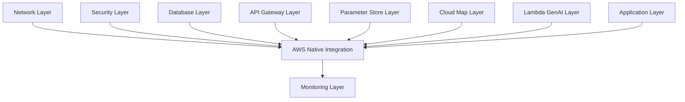

# AWS Native Services 통합 레이어

## 🏗️ 클린 아키텍처 원칙 적용

### **Single Responsibility Principle (SRP)**
- **단일 책임**: 오직 AWS 네이티브 서비스들 간의 **통합과 오케스트레이션**만 담당
- **기존 문제**: 여러 서비스를 직접 생성하여 책임이 분산됨
- **해결 방안**: 각 서비스는 개별 레이어에서 관리하고, 이 레이어는 통합만 담당

### **Open/Closed Principle (OCP)**
- **확장에 열려있음**: 새로운 AWS 서비스 통합 시 기존 코드 수정 없이 추가 가능
- **수정에 닫혀있음**: 기존 통합 로직은 변경하지 않고 새로운 통합만 추가
- **구현**: Feature Flag 패턴 사용 (`enable_genai_integration` 등)

### **Liskov Substitution Principle (LSP)**
- **인터페이스 일관성**: 모든 AWS 서비스 통합이 동일한 패턴을 따름
- **구현**: 표준화된 data source 패턴과 output 구조

### **Interface Segregation Principle (ISP)**
- **인터페이스 분리**: 각 서비스별로 필요한 정보만 참조
- **구현**: 개별 `terraform_remote_state` data source 사용

### **Dependency Inversion Principle (DIP)**
- **추상화 의존**: 구체적인 구현이 아닌 추상화된 인터페이스에 의존
- **구현**: Remote State를 통한 느슨한 결합

## 🏛️ AWS Well-Architected Framework 6가지 기둥

### 1. **Operational Excellence (운영 우수성)**
```hcl
# 자동화된 모니터링
resource "aws_cloudwatch_metric_alarm" "api_gateway_4xx_errors" {
  # 자동 알람 설정
}

# 통합 대시보드
resource "aws_cloudwatch_dashboard" "aws_native_integration" {
  # 모든 서비스 통합 모니터링
}
```

### 2. **Security (보안)**
```hcl
# WAF 보호
resource "aws_wafv2_web_acl" "api_gateway_protection" {
  # Rate limiting 및 보안 규칙
}

# 최소 권한 원칙
resource "aws_lambda_permission" "api_gateway_invoke" {
  # 특정 API Gateway에서만 Lambda 호출 허용
}
```

### 3. **Reliability (안정성)**
```hcl
# 헬스체크
resource "aws_route53_health_check" "api_gateway_health" {
  # 서비스 상태 모니터링
}

# 다중 서비스 통합으로 단일 장애점 제거
```

### 4. **Performance Efficiency (성능 효율성)**
```hcl
variable "genai_integration_timeout_ms" {
  # 최적화된 타임아웃 설정
  validation {
    condition = var.genai_integration_timeout_ms <= 29000
  }
}
```

### 5. **Cost Optimization (비용 최적화)**
```hcl
locals {
  common_tags = {
    # 비용 추적을 위한 상세 태그
    CostCenter     = var.cost_center
    AutoShutdown   = var.auto_shutdown_enabled ? "true" : "false"
  }
}
```

### 6. **Sustainability (지속 가능성)**
```hcl
variable "preferred_instance_types" {
  # 에너지 효율적인 인스턴스 타입 우선
  default = ["t4g.micro", "t4g.small"] # ARM 기반 Graviton
}

variable "enable_spot_instances" {
  # 스팟 인스턴스로 탄소 발자국 절약
}
```

## 📋 레이어 역할 및 책임

### **이 레이어가 하는 일** ✅
1. **서비스 간 통합**: API Gateway ↔ Lambda GenAI 연결
2. **통합 모니터링**: 모든 AWS 네이티브 서비스의 통합 대시보드
3. **보안 오케스트레이션**: WAF, 헬스체크 등 보안 기능 통합
4. **비용 추적**: 통합된 태깅 및 비용 최적화 정책

### **이 레이어가 하지 않는 일** ❌
1. **개별 서비스 생성**: API Gateway, Lambda 등은 각각의 전용 레이어에서 생성
2. **인프라 관리**: VPC, 보안 그룹 등은 기반 레이어에서 관리
3. **애플리케이션 로직**: 비즈니스 로직은 애플리케이션 레이어에서 관리

## 🔄 의존성 관계



## 🚀 사용 방법

### 1. **기본 배포**
```bash
cd terraform/envs/dev/aws-native
terraform init
terraform plan
terraform apply
```

### 2. **GenAI 통합 비활성화**
```bash
terraform apply -var="enable_genai_integration=false"
```

### 3. **WAF 보호 활성화**
```bash
terraform apply -var="enable_waf_protection=true"
```

### 4. **프로덕션 환경 설정**
```bash
terraform apply \
  -var="environment=prod" \
  -var="enable_waf_protection=true" \
  -var="enable_health_checks=true" \
  -var="auto_shutdown_enabled=false"
```

## 📊 모니터링 및 알람

### **생성되는 모니터링 리소스**
- **CloudWatch 대시보드**: 모든 AWS 네이티브 서비스 통합 뷰
- **CloudWatch 알람**: API Gateway 4xx/5xx 에러, Lambda 에러
- **Route 53 헬스체크**: API Gateway 엔드포인트 상태 모니터링

### **알람 임계값 (기본값)**
- API Gateway 4xx 에러: 10개/5분
- Lambda 에러: 5개/5분
- WAF 속도 제한: 2000 요청/5분

## 🔒 보안 기능

### **WAF 보호** (선택사항)
- Rate limiting: IP당 5분간 2000 요청 제한
- 지역별 차단 규칙 (필요시 추가 가능)
- SQL Injection, XSS 보호 (필요시 추가 가능)

### **API 보안**
- API 키 요구 (선택사항)
- Lambda 함수 호출 권한 최소화
- VPC 내부 통신 보안

## 💰 비용 최적화

### **비용 추적 태그**
```hcl
tags = {
  Project     = "petclinic"
  Environment = "dev"
  CostCenter  = "training"
  Service     = "integration"
  Component   = "orchestration"
}
```

### **자동 비용 절약**
- 개발 환경 자동 종료 설정
- 스팟 인스턴스 사용 (선택사항)
- 불필요한 백업 비활성화

## 🌱 지속 가능성

### **에너지 효율성**
- ARM 기반 Graviton 인스턴스 우선 사용
- 서버리스 아키텍처로 유휴 리소스 최소화
- 관리형 서비스 활용으로 운영 효율성 극대화

## 🔧 설정 옵션

### **주요 변수**
| 변수 | 기본값 | 설명 |
|------|--------|------|
| `enable_genai_integration` | `true` | GenAI 서비스 통합 활성화 |
| `enable_monitoring` | `true` | 모니터링 활성화 |
| `enable_waf_protection` | `false` | WAF 보호 활성화 |
| `enable_health_checks` | `false` | Route 53 헬스체크 활성화 |
| `auto_shutdown_enabled` | `true` | 개발 환경 자동 종료 |

### **환경별 권장 설정**

#### **개발 환경 (dev)**
```hcl
enable_genai_integration = true
enable_monitoring = true
enable_waf_protection = false
enable_health_checks = false
auto_shutdown_enabled = true
```

#### **프로덕션 환경 (prod)**
```hcl
enable_genai_integration = true
enable_monitoring = true
enable_waf_protection = true
enable_health_checks = true
auto_shutdown_enabled = false
```

## 🎯 결론

이 레이어는 **클린 아키텍처**와 **AWS Well-Architected Framework**의 모든 원칙을 준수하여:

1. **단일 책임**: 오직 서비스 통합만 담당
2. **확장성**: 새로운 서비스 추가 시 기존 코드 수정 없음
3. **보안**: 다층 보안 및 최소 권한 원칙
4. **비용 효율성**: 상세한 비용 추적 및 최적화
5. **지속 가능성**: 에너지 효율적인 아키텍처

**AWS 네이티브 서비스들의 진정한 통합과 오케스트레이션**을 제공합니다! 🚀